---

# HyperDrive MicroController Storage Engine (HMSE)

### Can Useful Compression Be Achieved in Very Low-Power Environments?


**Author:** Autumn Celeste ([@1jamie](https://github.com/1jamie))  
**Project:** HyperDrive MicroController Storage Engine (HMSE)  
**License:** [CC BY-NC-SA 4.0](https://creativecommons.org/licenses/by-nc-sa/4.0/) (Attribution-NonCommercial-ShareAlike)  
**Commercial Licensing:** Contact author for commercial use arrangements

---

> **⚠️ WORK IN PROGRESS**
> 
> This document represents a **research specification and design proposal** that is currently under development. The architecture, algorithms, and performance projections described herein have not been fully implemented or validated. All compression ratios, throughput figures, and capacity estimates are **theoretical projections** based on established algorithms and hardware specifications, but require empirical validation through real-world testing.
>
> **Key Considerations:**
> - Implementation is planned but not yet complete
> - All performance numbers require verification with actual hardware and workloads
> - Mathematical models need validation against real Wikipedia corpus data
> - System integration and optimization phases are pending
>
> This specification serves as a comprehensive blueprint for research and development purposes.
>
> **📋 Validation Plan:** See [VALIDATION_METHODS.md](./VALIDATION_METHODS.md) for the complete experimental methodology, statistical analysis framework, and reproducibility requirements.

---

## Table of Contents

1. [Abstract and Motivation](#1-abstract-and-motivation)
2. [System Architecture Overview](#2-system-architecture-overview)
3. [Scientific and Technical Rationale](#3-scientific-and-technical-rationale)
4. [Feasibility Analysis and Mathematical Proof](#4-feasibility-analysis-and-mathematical-proof)
5. [Discussion and Practical Implications](#5-discussion-and-practical-implications)
6. [Implementation Plan and Verification](#6-implementation-plan-and-verification)
   - [Phase 0: Foundation Setup](#phase-0-foundation-setup-and-performance-baseline)
   - [Phase 1: Lossless Compression](#phase-1-lossless-compression-l1)
   - [Phase 2: Content-Defined Deduplication](#phase-2-content-defined-deduplication-l2--l3)
   - [Phase 3: Similarity Deduplication](#phase-3-similarity-deduplication-and-final-goal)
7. [Data Flow Architecture](#7-data-flow-architecture)
8. [Storage Budget Analysis](#8-storage-budget-analysis)
9. [Real-World Test Cases](#9-real-world-test-cases)
10. [Validation Methodology](./VALIDATION_METHODS.md) 📄
11. [References](#references)

---

## 1. Abstract and Motivation

### 🌟 Plain-English Summary

We're testing whether a **$8 microcontroller** can compress data better than traditional embedded systems **while using 5× less power than a Raspberry Pi Zero**. The system works like a smart librarian who: (1) compresses text, (2) finds duplicate chapters, and (3) only stores the differences between similar documents. We think we can fit **5-10× more data** than standard compression (like ZIP files), but we need to test if it actually works. Even if we only achieve modest improvements (5×), the **energy savings** (83% less power than RPi Zero running BZ2) make it valuable for satellites, data loggers, and solar-powered field stations.

**Key uncertainty**: We're testing on diverse data types (Wikipedia, scientific papers, news articles, code repositories) to see which compress best. Different data types have different redundancy patterns—Wikipedia has high redundancy (templates), while scientific papers have low redundancy (unique notation).

---

### 📐 Technical Abstract

The **HyperDrive MicroController Storage Engine (HMSE)** is a **research specification** investigating whether **useful compression ratios can be achieved in very low-power environments** using multi-layered data reduction on the **ESP32-S3**.

**Research Question:** Can a microcontroller-class device (<1W power) achieve compression factors competitive with or exceeding traditional algorithms (BZ2, zstd) through multi-layer processing?

**Space Applications Context:** This research is particularly relevant to **space data systems**, where the [CCSDS 121.0-B-3 Lossless Data Compression standard](https://ccsds.org/wp-content/uploads/gravity_forms/5-448e85c647331d9cbaf66c096458bdd5/2025/01//121x0b3.pdf?gv-iframe=true) establishes baseline compression requirements for satellite missions. HMSE's multi-layer approach could potentially exceed CCSDS standard performance while operating within the severe power constraints typical of spacecraft systems.

**Definition of "Useful Compression":** For this research, **useful compression** is defined as achieving **CF ≥ 5:1**, which significantly exceeds typical single-pass algorithms (BZ2: ~3:1, zstd: ~3-4:1) and provides meaningful storage density improvements for embedded applications.

**Rationale for 5:1 Threshold:** This threshold is defined as the engineering trade-off point where the **storage density improvements and potential energy savings** (on transmission, storage media costs, and archival) begin to **substantially outweigh** the added implementation complexity and computational overhead of a multi-layer system in a resource-constrained environment. 

**Quantitative justification (§5.7)**: For bandwidth-constrained scenarios (e.g., 1 Mbps satellite downlink), CF = 5:1 provides **36× energy return on investment** — every 1 Wh spent on compression saves 36 Wh in transmission. Below 5:1, ROI drops below 30×, making multi-layer deduplication harder to justify. Above 5:1, HMSE's multi-layer approach justifies its complexity through massive transmission energy savings.

**Test Corpora:** Four diverse **10 GB samples** (Wikipedia, arXiv papers, news articles, GitHub code) compressed onto an **8 GB MicroSD Card** provide a rigorous, generalizable benchmark. Success requires **CF ≥ 5:1 on ≥50% of corpora** (at least 2 out of 4).

> **⚠️ Wikipedia as Best-Case, Not Typical-Case Benchmark**
>
> Wikipedia is **the single most compression-friendly text corpus on Earth** due to:
> - **Structural monoculture**: 99% of articles use identical template syntax
> - **Collaborative editing**: Near-duplicate boilerplate across millions of pages
> - **Infobox redundancy**: Same 20 templates copy-pasted with minor parameter changes
> - **Citation clustering**: Same references appear in thousands of articles
>
> **This is like benchmarking a car's fuel efficiency by driving downhill.**
>
> **Realistic Success Criteria**: System must achieve **CF ≥ 5:1 on ≥50% of tested corpora** (arXiv papers, news articles, GitHub code, random data), not just Wikipedia. Wikipedia results should be reported as **"best-case: 8.7:1"**, with median performance across diverse datasets as the primary metric.

**Test Corpora (10 GB samples each, tested separately):**
- **Wikipedia**: Random article sample from enwiki dump (high redundancy: templates, infoboxes)
- **arXiv Papers**: Scientific publications 2020-2024 (low redundancy: unique notation, equations)
- **News Articles**: Common Crawl subset (medium redundancy: temporal patterns, boilerplate)
- **GitHub Code**: Popular repositories (medium redundancy: functions, imports, repeated structures)
- **Target physical storage**: 8 GB MicroSD (each corpus tested in separate runs)

**Compression Strategy (Hypothesized):**
- **L1-L4 pipeline operates on each 10 GB decompressed corpus** in separate test runs
- **Per-corpus storage**: Full 8 GB card available per test (10 GB → 7.2 GB after overhead = **1.39:1 minimum**)
- **Success criterion**: At least 2 out of 4 corpora achieve CF ≥ 5:1 (much more achievable with full 8 GB per test)

**Architectural Approach:** This system operates as a **self-contained, offline batch processor** using a **dual-SD card architecture**:
- **Input SD Card**: 16 GB card pre-loaded with test corpus samples (or reload 10 GB per test)
- **Output SD Card**: Stores compressed result for each corpus test (8 GB total per run)
- **Processing Model**: Separate test runs per corpus (~5 hours each), output card reused/overwritten between tests

**Key Advantage:** Processing speed is **decoupled from feasibility**. The system's viability depends solely on achieving CF ≥ 5:1 on ≥50% of corpora (2 out of 4 separate tests), not on meeting real-time throughput constraints. Each corpus gets the full 8 GB output card capacity.

**All performance projections require empirical validation.**

**Note:** The system ingests **decompressed text** from each corpus (10 GB per corpus) from the input SD card. DEFLATE is applied to raw text, not to already-compressed data.

### Units Convention

**Throughout this document:**
- **MB = 10⁶ bytes (decimal megabytes)** — used for storage capacities and industry-standard comparisons
- **MiB = 2²⁰ bytes = 1,048,576 bytes (binary mebibytes)** — used for throughput calculations and precise memory allocations
- **KB = 10³ bytes; KiB = 2¹⁰ bytes = 1,024 bytes**
- When comparing to SD card specs or batch processing speeds, we use decimal MB/s (matching industry datasheets)
- Internal memory allocations (PSRAM, buffers) use binary MiB for precision

---

## 2. System Architecture Overview

### 2.1 Hardware Architecture

The HMSE system leverages the ESP32-S3's dual-core architecture with asymmetric task assignment to optimize I/O responsiveness and computational throughput:

```mermaid
graph TB
    %% External Components - Dual SD Card Architecture
    SD_In[("📥 Input SD Card<br/>16 GB<br/>Test Corpora<br/>4 × 10 GB samples")]
    SD_Out[("📤 Output SD Card<br/>8 GB<br/>Compressed Archive")]
    
    %% Main MCU Container
    subgraph ESP32["🔧 ESP32-S3 Microcontroller"]
        
        %% Core 0 - I/O Management
        subgraph Core0["⚡ Core 0 - I/O Handler<br/>(Priority 5)"]
            SDMMC["💿 SDMMC Driver (Input)<br/>4-bit @ 40 MHz<br/>**Target:** 5-15 MB/s read"]
            SPI_SD["💿 SPI Driver (Output)<br/>40 MHz<br/>**Target:** ~4 MB/s write"]
        end
        
        %% Core 1 - Processing Pipeline
        subgraph Core1["🧠 Core 1 - HMSE Engine<br/>(Priority 3)"]
            L1["📦 L1: DEFLATE<br/>Compression<br/>1 MB Window"]
            L2["✂️ L2: FastCDC<br/>Content Chunking<br/>Rabin Hash"]
            L3["🔍 L3: SHA-256<br/>Exact Dedupe<br/>HW Accelerated"]
            L4["🔗 L4: LSH/MinHash<br/>Similarity Detection<br/>Delta Encoding"]
        end
        
        %% Memory Subsystem
        subgraph Memory["🧮 8 MB PSRAM"]
            Dict["📚 Compression Dictionary<br/>1 MB"]
            Index["🗂️ Hash Index<br/>6 MB<br/>(158K entries)"]
            Buffers["📋 I/O Buffers<br/>1 MB"]
        end
    end
    
    %% Main Data Flow - Batch Processing
    SD_In -->|"Read raw data<br/>(asynchronous batch)"| SDMMC
    SDMMC -->|Inter-core Queue| Buffers
    Buffers -->|Process Data| L1
    L1 -->|Compressed| L2
    L2 -->|Chunks| L3
    L3 -->|Deduplicated| L4
    L4 -->|Final Data| SPI_SD
    SPI_SD -->|Write compressed| SD_Out
    
    %% Metadata Flow (Index Persistence)
    L3 -.->|"Persist index<br/>(periodic flush)"| SD_Out
    L4 -.->|"Persist LSH tables<br/>(periodic flush)"| SD_Out
    
    %% Memory Access Patterns
    L1 -.->|Read/Write| Dict
    L3 -.->|Hash Lookup| Index
    L4 -.->|LSH Probe| Index
    Core0 -.->|Buffer Management| Buffers
    
    %% Styling
    classDef coreBox fill:#2d3748,stroke:#4a5568,stroke-width:2px,color:#fff
    classDef memoryBox fill:#1a365d,stroke:#2c5282,stroke-width:2px,color:#fff
    classDef layerBox fill:#2f855a,stroke:#38a169,stroke-width:2px,color:#fff
    classDef externalBox fill:#744210,stroke:#975a16,stroke-width:2px,color:#fff
    
    class Core0,Core1 coreBox
    class Memory memoryBox
    class L1,L2,L3,L4 layerBox
    class SD_In,SD_Out externalBox
```



**Architectural Model:** Self-contained dual-SD batch processor
- **Input**: 16 GB SD card with pre-loaded test corpora (or reload 10 GB per test)
- **Output**: 8 GB SD card receives compressed result (one corpus per test run, overwritten between tests)
- **Processing**: Asynchronous batch processing at MCU's natural pace (~0.5-0.8 MB/s projected, ~5 hours per corpus)
- **Feasibility**: Depends **only** on achieving CF ≥ 5:1 on ≥50% of separate corpus tests, not on processing speed

**Note on SD Card Performance:** Target speeds (5-15 MB/s read, 4 MB/s write) are theoretical maximums based on interface specs. Actual performance depends on card quality, fragmentation, and ESP-IDF driver tuning. See §7.1 for detailed latency breakdown with realistic assumptions.

---

### 2.1.1 Architectural Design Rationale: Why Dual-SD Instead of USB?

**Design Decision Context:**

Early conceptual designs considered USB 1.1 streaming (PC → ESP32-S3 → SD output), which would provide familiar PC-based workflows and faster batch completion (~26 hours). However, analysis of **actual deployment scenarios** revealed that USB adds complexity without addressing real-world requirements.

**Why Dual-SD Architecture Was Selected:**

| Factor | USB 1.1 Streaming | Dual-SD Batch Processing | Decision |
|--------|-------------------|--------------------------|----------|
| **Deployment fit** | Requires host PC tethering | Autonomous operation | ✅ **Dual-SD wins** |
| **Target scenarios** | Dev/test workstation only | Satellites, data loggers, field stations | ✅ **Dual-SD matches reality** |
| **Firmware complexity** | USB CDC/MSC drivers (~50 KB) | Simple SD/SPI drivers (~15 KB) | ✅ **Dual-SD simpler** |
| **Power overhead** | USB PHY negotiation spikes | Steady-state operation | ✅ **Dual-SD cleaner** |
| **Operational model** | Continuous PC connection | "Sneakernet" (swap cards, not cables) | ✅ **Dual-SD more practical** |

**Real-World Use Cases That Don't Need USB:**

```
1. Satellite Preprocessing:
   - Onboard telemetry → Input SD (days/weeks)
   - Compress autonomously while orbiting
   - Output SD → Downlink via RF (not USB)

2. Solar-Powered Data Logger:
   - Sensors → Large SD (continuous logging)
   - Periodic batch compression to small SD
   - Retrieve output card monthly (no PC on-site)

3. Offline Wikipedia Kiosk:
   - Pre-load input SD with corpus (one-time)
   - Compress on-device over 36 hours
   - Deploy output SD to 1000s of kiosks (no USB)

4. Field Research Station:
   - Instruments log to 128 GB card
   - Compress to 8 GB for courier pickup
   - Autonomous operation (no PC available)
```

**Trade-Offs Explicitly Accepted:**

- ❌ **Slower batch completion**: 36 hours (dual-SD) vs. hypothetical 26 hours (USB) — acceptable for all use cases above
- ❌ **Less convenient for development**: Requires SD card swapping during testing — mitigated by using USB for logging/debugging only (data path stays dual-SD)

**What This Is NOT:**

- ❌ **Not a performance retreat**: System can achieve the same 0.5-0.8 MB/s with or without USB
- ❌ **Not avoiding USB 1.1 speed limits**: 1.2 MB/s USB throughput would be plenty; we simply don't need it
- ❌ **Not a late-stage pivot**: This analysis was part of requirements engineering, not damage control

**Conclusion:**

Dual-SD architecture is **fitness-for-purpose design**. It eliminates a dependency (host PC) that doesn't exist in target deployments, simplifies firmware, and reduces power overhead. The throughput range (0.49–1.40 MB/s) now only affects **batch completion time** (26-77 hours), which is acceptable for autonomous, offline processing scenarios.

---

### 2.2 Memory Allocation Map

| Memory Region | Size     | Purpose                                | Access Pattern             | Persistence |
|---------------|----------|----------------------------------------|----------------------------|-------------|
| PSRAM Dict    | 1.0 MB   | DEFLATE sliding window (2²⁰ bytes)    | Sequential R/W (L1)        | Volatile    |
| PSRAM Index   | 6.0 MB   | **Working-set cache** for L3 index (~150K most recent entries) | Random R/W (L3, L4) | Volatile (cache) |
| PSRAM Buffers | 1.0 MB   | Inter-core queues, temp storage        | Ring buffer (Core 0 ↔ 1)   | Volatile    |
| **Total**     | **8 MB** | **SPIRAM (MALLOC_CAP_SPIRAM)**         | —                          | —           |

**Index Architecture:**
- **In-PSRAM working set (6 MB)**: Hot cache for ~150K most recently accessed chunk entries; LRU eviction
- **Persistent L3 index (450 MB on SD card)**: Full hash table with 11.25M entries; see §8.2 for sizing
- **L4 band tables (150 MB on SD card)**: LSH similarity index; see §8.3 for structure

**Note:** SRAM (520 KB) is reserved for critical FreeRTOS tasks, interrupt handlers, and stack allocation. All heavy data processing uses PSRAM to avoid cache thrashing. The PSRAM index is a **cache**, not the complete index—the complete L3 and L4 indices are persisted on the SD card.

---

## 3. Scientific and Technical Rationale

The HMSE engine processes data through four cascading software layers running on **Core 1**, with the index resident in the **8 MB PSRAM**.

### 3.1 Four-Layer Processing Pipeline

| Layer                            | Technique                                        | Scientific Basis                                                                                                                   | Hypothesized Factor (CF)       | Confidence Level | Throughput Budget **(Projected, Unvalidated)** | Core 1 Resource Trade        |
| -------------------------------- | ------------------------------------------------ | ---------------------------------------------------------------------------------------------------------------------------------- | ------------------------------ | ---------------- | ----------------- | ---------------------------- |
| **L1: Lossless Compression**     | DEFLATE (Level 9) with **1 MB PSRAM Window (W)** | LZ77 Principle [2,3]: Compression ratio (CR) ∝ dictionary size W. PSRAM removes the W constraint of SRAM-limited MCUs.               | 3:1 to 4:1 (Intra-Chunk)       | **Plausible** (2-4× typical on text; requires benchmark) | ~1.5 MB/s (projected)        | ≈ 20 % CPU Time (estimated)             |
| **L2: Content-Defined Chunking** | FastCDC (Rabin Hash, target 4 KiB avg, min 1 KiB, max 16 KiB) | Rabin Fingerprinting [1,4]: Boundaries are content-determined (H ≡ 0 mod P) rather than offset-based, resisting data shifting. | > 99 % Boundary Preservation | **Validated** (well-established in literature [1]) | ~8 MB/s (projected) | ≈ 10 % CPU Time (estimated) |
| **L3: Exact Deduplication**      | SHA-256 Hashing on Unique Chunks                 | Cryptographic collision resistance uniquely identifies blocks for storage index management. Uses ESP32-S3 HW acceleration [13].         | 1.1:1 to 10:1 (Variable)       | **Optimistic** (50% exact-duplicate assumption; corpus-dependent) | ~15 MB/s (projected)         | ≈ 5 % CPU Time (estimated) |
| **L4: Similarity Deduplication** | LSH (MinHash: n=128, **b=4, r=32**) + Delta Encoding (xdelta3) | Jaccard Similarity [5,6,7,8]: Probabilistically clusters similar MinHash vectors. Delta coding can save ~80% of near-duplicate block size (empirically corpus-dependent; bench and validate). | 15:1 to 50:1 on Iterative Data | **Optimistic** (50% similar-chunk assumption + 80% delta efficiency; requires validation on Wikipedia corpus) | ~1.2 MB/s (projected)        | ≈ 50 % CPU Time (estimated)     |

**⚠️ Critical Caveat:** All throughput and CPU budget values are **theoretical projections** based on algorithm benchmarks from other platforms. **No ESP32-S3 measurements have been performed**. Actual performance may be significantly lower due to:
- PSRAM access latency (slower than SRAM)
- Cache contention between cores
- FreeRTOS scheduling overhead
- SD card I/O bottlenecks

**Batch processing model:** System is not constrained by real-time throughput requirements; processing speed determines completion time, not feasibility.

### 3.2 Data Transformation Pipeline


<details>
<summary><b>Example: Data Transformation Through All Layers</b></summary>

**Input (64 bytes):**
```
The quick brown fox jumps over the lazy dog. The quick brown fox jumps.
```

**After L1 (DEFLATE):** 
```
Compressed: 41 bytes (1.56:1 ratio)
[Binary DEFLATE stream with LZ77 backreferences]
```

**After L2 (FastCDC):**
```
Chunk detected at byte 41 (Rabin hash: 0x00003A7F ≡ 0 mod 0x3A7F)
Chunk ID: #4829
```

**After L3 (SHA-256 Dedupe):**
```
Hash: a3d8f9c2e1b5... (first 12 hex digits shown)
Lookup in index: NOT FOUND
→ Store to SD at LBA 0x0000A420, Length: 41 bytes
→ Update index: SHA-256 → (LBA: 0x0000A420, Len: 41)
```

**After L4 (MinHash/LSH):**
```
MinHash signature computed (128 hashes)
LSH Probe: Similar chunk found (Jaccard: 0.87)
→ Delta encoding against base chunk #4201
→ Delta size: 8 bytes (5.1:1 ratio)
→ Store delta record instead of full chunk
```

**Physical Storage:** 8 bytes (delta) + 4 bytes (metadata) = **12 bytes total** (5.3:1 overall)

</details>

---

## 4. Feasibility Analysis and Mathematical Proof

**Critical Simplification (Dual-SD Architecture):**  
With the **asynchronous batch processing** model, system feasibility depends **solely on achieving the required compression factor**. Processing throughput is no longer a feasibility criterion—it only determines total batch completion time. This section therefore focuses exclusively on **storage density** analysis.

### 4.1 Baseline Requirements

The target is to compress each 10 GB text corpus onto an 8 GB MicroSD card in **separate test runs**:

**Test Corpora (10 GB each, decompressed, tested separately):**
- **Wikipedia**: Random article sample (high redundancy)
- **arXiv Papers**: Scientific publications (low redundancy)
- **News Articles**: Common Crawl subset (medium redundancy)
- **GitHub Code**: Popular repositories (medium redundancy)
- **Physical Storage Available:** 8 GB MicroSD per test run

**Required Compression Factor (Per-Corpus, Separate Runs):**
- **Storage available per test:** 8 GB - 0.8 GB (overhead) = **7.2 GB**
- **Per-corpus CF needed:** 10 GB ÷ 7.2 GB = **1.39:1** minimum to fit on card
- **Success criterion:** CF ≥ 5:1 on at least **2 out of 4 separate corpus tests** (≥50%)

**Important:** The HMSE pipeline processes **decompressed text** (10 GB per corpus), not pre-compressed files. Each corpus is tested in a separate compression run with the full 8 GB card available. Output card is reused/overwritten between tests.

### 4.2 Layer-by-Layer Reduction Model

To **hypothesize** feasibility under optimistic assumptions, we model compression through all four layers on representative Wikipedia data. **These projections require empirical validation** and may not reflect actual performance.

| Stage                    | Size (MB) | Compression Factor | Cumulative Factor | Notes                                                      |
|--------------------------|-----------|--------------------| ------------------ |------------------------------------------------------------|
| **Raw Text**             | 100.0     | —                  | 1.0:1              | Sample: 100 MB of Wikipedia articles (decompressed)        |
| **After L1 (DEFLATE)**   | 33.3      | 3.0:1              | 3.0:1              | **Plausible**: 1 MB window captures repetitive structures                 |
| **After L2 (FastCDC)**   | 33.3      | 1.0:1              | 3.0:1              | **Validated**: Boundary detection only; no size change                    |
| **After L3 (Exact)**     | 16.7      | 2.0:1              | 6.0:1              | **Optimistic**: Assumes ~50% exact duplicates (unvalidated)    |
| **After L4 (Similarity)**| 11.5      | 1.45:1             | **8.7:1**          | **Optimistic**: Assumes ~30% similar variants with 80% delta efficiency (unvalidated) |

**⚠️ Critical Assumption:** The cumulative 8.7:1 factor assumes high redundancy in Wikipedia. Actual performance depends on corpus characteristics and may be significantly lower.

---

> **🔴 CRITICAL: Circular Reasoning in Feasibility Projections**
>
> The 8.7:1 projection is built on **unvalidated redundancy assumptions**:
> - **L3 (Exact dedupe)**: Assumes **50% duplicate chunk rate** → **No empirical evidence provided**
> - **L4 (Similarity)**: Assumes **30% similar chunks + 80% delta efficiency** → **No empirical evidence provided**
>
> **Problem**: We're projecting feasibility based on hypothesized redundancy rates, then using those projections to justify the design. This is **assuming our conclusion**.
>
> **Impact**: If actual Wikipedia redundancy is **40% instead of 70%**, the system **fails the 8 GB target entirely**.
>
> **Required Action BEFORE Full Implementation**:
> 1. ✅ **Run L3 exact-dedupe on 1 GB Wikipedia sample** → Measure actual duplicate rate
> 2. ✅ **Run L4 similarity detection on sample** → Measure actual similar chunk rate and delta efficiency  
> 3. ✅ **Revise all projections** based on empirical data, not optimistic guesses
> 4. ✅ **Redefine success criteria** if measured redundancy < 50%
>
> **Current Status**: These are **hypotheses requiring validation**, not established facts. Treat 8.7:1 as a **best-case scenario**, not an expected outcome.

---

**Blended Corpus Estimate (Theoretical Model):**

**Hypothesis:** Wikipedia content exhibits varying redundancy levels. The following estimates are **unvalidated assumptions** based on corpus structure analysis (not empirical measurements):

| Content Type         | % of Corpus | Hypothesized CF | Weighted Contribution |
|----------------------|-------------|-------------|-----------------------|
| Article Text         | 60%         | 4.0:1 ± 1.0 | 2.40                  |
| Templates/Infoboxes  | 20%         | 15.0:1 ± 5.0 | 3.00                  |
| Citations/References | 15%         | 8.0:1 ± 2.0 | 1.20                  |
| Metadata/Categories  | 5%          | 6.0:1 ± 2.0 | 0.30                  |
| **Weighted Average** | **100%**    | —           | **6.90:1 ± 2.1**      |

**⚠️ Circular Reasoning Risk:** These percentages are design targets, not empirically measured values. Actual Wikipedia redundancy may be lower, requiring validation before claiming feasibility.

---

**Why Two Different Projections? (8.7:1 vs 6.90:1)**

The **Layer-by-Layer model** (8.7:1) represents a **best-case scenario** assuming uniform Wikipedia text where all content types compress similarly. 

The **Blended Corpus model** (6.90:1) represents a **conservative estimate** that accounts for varying content types with different compression profiles:
- High-redundancy content (templates, citations) compresses well (8-15:1)
- Low-redundancy content (scientific articles, unique prose) compresses poorly (4-6:1)
- The weighted average across content types yields a lower overall estimate

**Which to use?** The 6.90:1 estimate is more realistic for heterogeneous corpora. The 8.7:1 estimate assumes optimal conditions. **Both require empirical validation.** For conservative planning, use 6.90:1; for optimistic projections, use 8.7:1.

### 4.3 Safety Margin and Overhead Analysis

**Revised Assessment:** With separate test runs, each corpus gets the full 8 GB card capacity (minimum CF needed: 1.39:1 to fit). The optimistic projection of **8.7:1** for Wikipedia **far exceeds** minimum requirements. Projected performance across corpora:
- **Wikipedia**: 8.7:1 (✓ exceeds 5:1 threshold)
- **News**: 5:1 (✓ meets 5:1 threshold)
- **GitHub**: 4:1 (⚠️ below threshold but fits on card)
- **arXiv**: 2.5:1 (⚠️ below threshold but fits on card)

System is expected to achieve success criterion: **≥50% of corpora meeting CF ≥ 5:1** (Wikipedia and News).

**Overhead Accounting:**

| Overhead Component        | Size (MB) | % of 8 GB | Description                                    |
|---------------------------|-----------|-----------|------------------------------------------------|
| Hash Index (PSRAM mirror) | 450       | 5.5%      | SHA-256 + LBA + Length per unique chunk        |
| LSH Band Tables           | 150       | 1.9%      | **⚠️ Configuration-dependent**: 4-band config fits 150 MB; 8-band requires 300 MB (see §8.3 for implementation decision)         |
| Delta Storage Metadata    | 80        | 1.0%      | Base chunk pointers for delta-encoded chunks   |
| Filesystem Overhead       | 80        | 1.0%      | FAT32 allocation tables                        |
| Reserved/Fragmentation    | 40        | 0.5%      | Safety buffer for write amplification (may need 2-4× for SD card wear leveling)          |
| **Total Overhead**        | **800**   | **10%**   | **⚠️ Likely underestimated by ~150-200 MB**                                              |

**Effective Storage Capacity:** 8000 MB - 800 MB = **7200 MB** (Optimistic; realistic: **7000-7100 MB** with corrected overhead)

**Storage Analysis (Separate Test Runs):** 
- **Per-test storage available:** 8 GB - 0.8 GB (overhead) = **7.2 GB**
- **Minimum CF to fit:** 10 GB ÷ 7.2 GB = **1.39:1** (very achievable)
- **Target CF for "useful" compression:** **5:1** (exceeds BZ2, justifies complexity)

**Projected Outcomes by Corpus (Separate Runs):**
- **Wikipedia**: 10 GB → 1.15 GB (8.7:1) ✓ **Exceeds 5:1 threshold, fits easily**
- **News**: 10 GB → 2.0 GB (5:1) ✓ **Meets 5:1 threshold, fits easily**
- **GitHub**: 10 GB → 2.5 GB (4:1) ⚠️ **Below 5:1 threshold, but fits on card**
- **arXiv**: 10 GB → 4.0 GB (2.5:1) ⚠️ **Below 5:1 threshold, but fits on card**

**Success Assessment:** System achieves **2 out of 4 corpora ≥ 5:1** (Wikipedia and News), meeting the success criterion. All corpora fit comfortably on the 8 GB card in their respective test runs (largest is arXiv at 4 GB < 7.2 GB available).

**Risk Assessment:** Success criterion (≥50% of corpora ≥ 5:1) is **highly achievable** based on projections. Even "failure" cases (GitHub, arXiv) exceed the 1.39:1 minimum to fit on card and outperform BZ2 (3:1). The separate-run approach eliminates storage contention and validates generalizability.

**Note:** The projected 8.7:1 ratio is optimistic and assumes the 100 MB sample is representative. **Actual Wikipedia corpus performance is unknown** and requires empirical validation before claiming feasibility.

### 4.4 Comparison: ESP32-S3 vs Embedded Alternatives

**Primary Comparison: Raspberry Pi Zero (Embedded Baseline)**

| Metric                  | ESP32-S3 HMSE         | Raspberry Pi Zero (BZ2)   | Advantage           |
|-------------------------|-----------------------|---------------------------|---------------------|
| **Cost**                | $8 (MCU + 2× SD cards)| $15 (RPi + SD card)       | **47% cheaper**     |
| **Power Consumption**   | 0.5 W                 | 2.5 W (BZ2 load)          | **5× lower**        |
| **Dictionary Size (L1)**| 1 MB (PSRAM)          | 900 KB (BZ2 default)      | Comparable          |
| **SHA-256 Speed**       | HW Accelerated        | Software                  | Faster              |
| **Batch Time (40 GB)**  | 20 hours (4 corpora)  | 6.4 hours (measured)      | 3× slower           |
| **Energy (40 GB)**      | 10 Wh                 | 69 Wh                     | **86% lower**       |
| **Boot Time**           | <1 second (bare metal)| ~20 seconds (Linux)       | **20× faster**      |

**For detailed comparison analysis including use case decision tree, see Section 5.3.2.**

The MCU's advantages lie in **dedicated PSRAM** for large compression dictionaries without competing with system RAM, **deterministic real-time operation** (no OS overhead), and **ultra-low-power** operation suitable for battery-powered or solar-powered batch processing applications. Trade-off: 3× longer batch completion time vs RPi Zero.

---
## 5. Open Questions and Research Goals

This section outlines the **core research questions** driving this work. The central inquiry is not "Can we compress Wikipedia to 8 GB?" but rather: **Can we achieve useful compression ratios in very low-power environments?**

These are **exploratory inquiries**, not validated outcomes. They frame what we hope to learn through empirical testing.

---

### 5.1 Central Research Question: Useful Compression in Low-Power Environments

**What we want to learn:** Can microcontroller-class hardware (<1W power consumption) achieve compression that is **competitive with traditional PC-based algorithms** in terms of **final compression ratio and/or energy efficiency** (MB compressed per watt)?

**Core hypothesis:** By leveraging MCU-specific advantages (dedicated PSRAM for large dictionaries, hardware crypto acceleration, low-power continuous operation), a multi-layer pipeline could achieve:
- **Compression factors** competitive with or exceeding BZ2 (~3:1) and zstd (~3-4:1)
- **Energy efficiency** substantially better than PC-based compression (lower watts per GB compressed)
- **Useful storage density** for real-world embedded applications

**Key uncertainties:**
- Can a 1 MB PSRAM dictionary achieve 3:1+ compression on structured text corpora?
- Does chunk-level deduplication provide meaningful storage reduction on real datasets?
- Is the power/performance trade-off acceptable (low throughput but high compression per watt)?
- What compression factors are achievable across **diverse** workloads, not just Wikipedia?

**Multi-corpus approach:** Testing on four diverse 10 GB corpora (Wikipedia, arXiv, news, code) provides **rigorous validation** across different data types. Success criterion (CF ≥ 5:1 on ≥50% of corpora) validates the approach for generalizable deployment, not just optimistic Wikipedia results.

---

### 5.2 Research Question: What Level of Performance Is "Enough"?

**What we want to learn:** At what compression factor does the system become useful for real-world deployment?

**Tiered success criteria (exploratory, per-corpus):**
- **Minimum viable (5:1)**: Competitive with BZ2, proves useful compression
- **Moderate success (7:1)**: Justifies MCU complexity, strong validation
- **Wikipedia target (9:1)**: Best-case performance on high-redundancy corpus
- **Stretch goal (12:1)**: Exceptional performance (unlikely on diverse corpora)

**Open question:** If the system achieves only 5-7:1, does that still provide value? What applications would benefit from partial success?

---

### 5.3 Research Question: Can MCUs Compete on Efficiency?

**What we want to learn:** If HMSE meets its throughput targets, would it offer advantages over Raspberry Pi-class devices in energy and cost?

**Key uncertainties:**
- Will the ESP32-S3's power consumption (< 1 W) remain stable under sustained load?
- Does PSRAM access latency degrade performance below projections?
- Can thermal throttling be avoided in compact enclosures?

**If validated,** this would suggest opportunities for:
- Persistent offline archives in low-power environments
- Mesh-based distributed knowledge systems
- Portable devices for bandwidth-limited regions

**If not validated,** it would indicate that ARM-class processors remain necessary for this workload.

---

### 5.3.1 Total Energy Budget for Multi-Corpus Testing

**Complete compression cycle energy analysis (per 10 GB corpus):**

| Scenario | Processing Time | Power Draw | Energy per Corpus | Total (4 corpora) | Cost @ $0.15/kWh |
|----------|----------------|------------|-------------------|-------------------|------------------|
| **Best case** | 3.5 hours | 0.5 W | 1.75 Wh | 7 Wh | $0.001 |
| **Typical** | 5 hours | 0.5 W | 2.5 Wh | 10 Wh | $0.0015 |
| **Worst case** | 10 hours | 0.6 W (thermal load) | 6 Wh | 24 Wh | $0.0036 |

**Power Source Requirements (for all 4 corpora, typical case):**

| Source | Capacity Needed | Practical Implication |
|--------|----------------|----------------------|
| **Solar panel** | 10 Wh ÷ (6W panel × 4 hrs sun) = **0.4 days charging** | Half a sunny day charges enough for all corpora |
| **Battery pack** | 10 Wh ≈ 830 mAh @ 12V | **Half a laptop battery pack** |
| **Smartphone battery** | 10 Wh ≈ 2,700 mAh @ 3.7V | **One phone battery easily sufficient** |
| **Grid power** | $0.0015 electricity cost | Negligible (< $0.01) |

**Comparison to PC-based Compression (BZ2, per 10 GB corpus):**

| Platform | Compression Time | Power Draw | Total Energy | Energy per GB |
|----------|-----------------|------------|--------------|---------------|
| **Desktop PC** | 0.27 hours | 65 W | 17.3 Wh | 1.73 Wh/GB |
| **HMSE (typical)** | 5 hours | 0.5 W | 2.5 Wh | 0.25 Wh/GB |
| **Energy savings** | — | — | **86% reduction** | **86% more efficient** |

> **⚠️ Critical Context: Time-Value Trade-Off**
>
> This comparison shows **energy per GB**, not total time. The PC is **18× faster** (2 hours vs. 36 hours) for the same compression job.
>
> **Accurate framing**:
> - ✅ **Energy efficiency**: HMSE uses 86% less power per GB compressed
> - ✅ **Use case fit**: "HMSE sacrifices speed for efficiency; viable only when time is non-critical"
> - ❌ **False equivalence**: "HMSE is better than PC" (ignores 18× speed difference)
>
> **When is this trade-off acceptable?**
> - Solar-powered field stations (PC not available)
> - Satellite preprocessing (continuous autonomous operation)
> - Offline archival (one-time batch, multi-day window acceptable)
>
> **When is this trade-off NOT acceptable?**
> - Interactive workflows (PC is 18× faster)
> - Data centers (grid power cheap, speed critical)
> - Real-time pipelines (latency matters)

**Practical Implications:**
- HMSE can process **all 4 corpora** on a single smartphone battery (3,000-5,000 mAh typical capacity)
- Enables **off-grid compression** in remote locations (field research, disaster recovery, satellite preprocessing)
- **Solar-powered operation**: 6W panel + 10 Wh battery = autonomous compression station
- **Total electricity cost**: < $0.01 (vs. $0.026 for PC BZ2 compression of all corpora) — but PC finishes in 1 hr vs. 20 hrs

**Research significance:** Even if HMSE achieves only moderate compression on some corpora (5-7:1), the **energy efficiency advantage** (86% reduction) provides value for power-constrained applications where waiting 20 hours for batch completion is acceptable. The multi-corpus approach validates generalizability.

---

### 5.3.2 Comparison: ESP32-S3 vs Raspberry Pi Zero

**Why compare to RPi Zero?**
- Similar price point (~$15 vs. ~$8)
- Common choice for embedded compression tasks
- Representative of ARM Cortex-A class processors
- More realistic embedded comparison than desktop PC

| Metric | ESP32-S3 HMSE | Raspberry Pi Zero (BZ2) | HMSE Advantage |
|--------|---------------|-------------------------|----------------|
| **Cost** | $8 (MCU + 2× SD cards) | $15 (RPi + SD) | **47% cheaper** |
| **System Architecture** | RTOS (FreeRTOS) / Bare-metal | General-Purpose OS (Linux) | **Deterministic, low overhead, fast boot (<1s vs ~20s)** |
| **Power (compression)** | 0.5 W | 2.5 W (measured under BZ2 load) | **5× lower** |
| **Batch throughput** | 0.57 MB/s (projected) | 1.8 MB/s (BZ2 @ 1 GHz ARM11) | 3× slower |
| **Energy per GB** | 0.25 Wh/GB | 1.73 Wh/GB | **86% more efficient** |
| **Compression ratio** | 5-9:1 range (corpus-dependent) | 3:1 (BZ2 standard) | **1.7-3× better** (if validated) |
| **Total energy (40 GB)** | 10 Wh | 69 Wh | **86% energy savings** |
| **Batch time (40 GB)** | 20 hours | 6.4 hours | 3× slower |
| **Battery runtime** | 20 hours on smartphone battery | 10 hours on 25 Wh pack | 2× longer operation |

**Trade-off Summary:**
- **HMSE advantages**: Lower power (5×), higher projected CF (if validated), longer battery operation (3.6×), cheaper hardware (47%), deterministic RTOS (no OS overhead), faster boot (<1s)
- **RPi advantages**: Faster batch completion (3×), proven algorithm (BZ2), established ecosystem, general-purpose OS flexibility

**Use Case Decision Tree:**

```
Do you have >5W power budget available?
  └─ Yes → Use Raspberry Pi (faster completion)
  └─ No  → Use HMSE (much lower power requirement)

Do you need >8:1 compression?
  └─ Yes → Consider HMSE (if multi-layer dedupe validated)
  └─ No  → Either platform adequate

Is completion time critical (<24 hours)?
  └─ Yes → Use Raspberry Pi (12 hrs vs 36 hrs)
  └─ No  → HMSE acceptable (energy savings prioritized)

Operating on battery or solar?
  └─ Yes → HMSE strongly preferred (5× lower power)
  └─ No  → Either platform suitable
```

**Conclusion:** HMSE targets a **specific niche** (power-constrained, high-compression scenarios) rather than claiming universal superiority. For satellite preprocessing, solar-powered field stations, or battery-operated data loggers, the energy advantage (83% savings) outweighs the 3× longer completion time. The system's potential compliance with [CCSDS 121.0-B-3](https://ccsds.org/wp-content/uploads/gravity_forms/5-448e85c647331d9cbaf66c096458bdd5/2025/01//121x0b3.pdf?gv-iframe=true) standards makes it particularly relevant for space applications where power efficiency is critical.

**Sources:**
- RPi Zero power: Measured with INA219 during `bzip2 -9` compression
- RPi Zero throughput: Benchmarked with `time bzip2 -9 < 1GB_sample.txt > output.bz2`
- BZ2 compression ratio: Measured on Wikipedia sample dataset

---

### 5.4 Exploratory Application Domains

**What we hope to investigate:** If the system proves feasible, what domains could benefit?

| Domain | Hypothesized Use Case | Conditional Benefit |
|--------|-----------|----------|
| IoT & Sensor Networks | Local data aggregation | **If** L3/L4 dedupe works on sensor data, extends retention under bandwidth limits |
| Edge & Satellite Systems | On-device pre-compression | **If** throughput meets 1 MB/s, reduces transmission requirements; potential CCSDS 121.0-B-3 compliance |
| Educational / Offline Knowledge Systems | Large text datasets (e.g., Wikipedia) | **If** 8 GB target is met, enables access in bandwidth-limited regions |

**Critical dependencies:** Each application assumes the system meets its projected performance. Alternative use cases should be identified if performance falls short.

---

### 5.5 Risk Factors and Contingencies

**What could go wrong?** Several dependencies could prevent the system from meeting its goals:

| Risk Factor | Uncertainty | Contingency Plan |
|-------------|-------------|------------------|
| **Low corpus redundancy** | Wikipedia may have < 50% exact duplicates | Test on diverse corpora; define fallback success criteria |
| **PSRAM latency bottleneck** | Cache misses may reduce throughput below 1 MB/s | Implement prefetching; consider 32 MB PSRAM module |
| **LSH storage overflow** | 300 MB L4 index may exceed budget | Reduce to 4 bands; use compact encoding; accept 16 GB card |
| **Flash wear-out** | Repetitive writes may degrade SD card | Implement wear leveling; rotate write locations |
| **Thermal throttling** | Sustained load may reduce clock speed | Add heatsink; implement duty cycling |

**Open question:** If multiple risks materialize, at what point does the system become impractical? What is the acceptable failure threshold?

---

### 5.6 Failure Modes and Graceful Degradation Strategies

**What happens when things go wrong?** Rather than binary success/failure, the system should degrade gracefully:

| Failure Scenario | Impact | Graceful Degradation Strategy |
|------------------|--------|-------------------------------|
| **L3 dedupe achieves only 20% (not 50%)** | CF drops to ~5.2:1 → Misses 8 GB target | ✅ **Fallback**: Use 16 GB card; still achieves 5:1 "useful" threshold |
| **PSRAM fails after 10,000 hours** | Hash index inaccessible → Data loss | ✅ **Mitigation**: Periodic index checkpoints to SD; rebuild from chunk headers if needed |
| **SD card wear-leveling breaks at 500 cycles** | Write corruption → System unusable | ✅ **Detection**: CRC validation on all writes; automatic read-only mode on error threshold |
| **Wikipedia format changes (more images, less text)** | Invalidates benchmark assumptions | ✅ **Adaptation**: Define success on arXiv/news corpora instead; Wikipedia becomes bonus |
| **Thermal throttling reduces clock to 160 MHz** | Batch time increases 1.5× (36 hrs → 54 hrs) | ✅ **Acceptable**: Still within multi-day batch window; add thermal monitoring to firmware |
| **Throughput drops to 0.3 MB/s (worse than projected)** | 10 GB takes 9.3 hours per corpus (40 GB = 37 hours total) | ✅ **Decision point**: Acceptable for autonomous operation; unacceptable for interactive use |

**System Modes Based on Degradation:**

```
Mode 1: Full Pipeline (Best-case)
- All layers operational (L1+L2+L3+L4)
- CF: 8.7:1 (hypothesized)
- Use case: Wikipedia-like corpora

Mode 2: No Similarity Detection (L3 fails or insufficient PSRAM)
- Layers: L1+L2+L3 only
- CF: 6.0:1 (guaranteed if L3 works)
- Use case: Still exceeds "useful" threshold

Mode 3: Exact Dedupe Only (L4 disabled to save storage)
- Layers: L1+L2+L3
- CF: 6.0:1 (guaranteed)
- Use case: Minimal complexity, max reliability

Mode 4: Lossless Compression Only (Fallback)
- Layers: L1 only
- CF: 3.0:1 (guaranteed, matches BZ2)
- Use case: System functions as simple compressor

Mode 5: Read-Only Archive (Write endurance depleted)
- No new writes allowed
- CF: N/A (existing archive remains accessible)
- Use case: Long-term static deployment
```

**Graceful Failure Philosophy:**

Instead of "works perfectly or fails completely," the system should:
1. **Detect** failure conditions early (CRC errors, thermal limits, PSRAM corruption)
2. **Downgrade** to simpler mode automatically (L1+L2+L3 if L4 fails)
3. **Preserve** existing data (read-only mode if write endurance depleted)
4. **Report** degraded state clearly (LED indicators, log messages)

---

### 5.7 Energy Break-Even Analysis and Total System Energy Model

> **🔬 Critical Context: Compression Energy is Only Part of the Story**
>
> Previous sections compared compression energy in isolation (HMSE: 18 Wh vs. PC: 130 Wh = 86% savings). But this ignores the **total system energy** including data transmission. For bandwidth-constrained systems (satellites, LoRa networks, field stations), **transmission energy dominates** the total energy budget, making compression overhead negligible.
>
> This section provides the **mathematical framework** to determine when compression is energy-positive and quantifies the "5:1 is useful" threshold with rigorous ROI analysis.

---

#### 5.7.1 Total Energy Model for Data Pipelines

For any data transmission pipeline, total energy consumption is:

$$E_{\text{total}} = E_{\text{compression}} + E_{\text{transmission}}$$

Where:
- $E_{\text{compression}} = P_{\text{compress}} \times T_{\text{compress}}$ (Watt-hours)
- $E_{\text{transmission}} = P_{\text{transmit}} \times \frac{S}{CF \times BW}$ (Watt-hours)
- $S = \text{Data}_{\text{size}}$ (in bits), $BW = \text{Bandwidth}$ (in bits/second)

---

**Deriving the Break-Even Compression Factor:**

Compression is energy-positive when:

$$E_{\text{total}}(CF) < E_{\text{total}}(CF = 1)$$

Expanding:

$$P_{\text{compress}} \cdot T_{\text{compress}} + P_{\text{transmit}} \cdot \frac{S}{CF \cdot BW} < P_{\text{transmit}} \cdot \frac{S}{BW}$$

Rearranging:

$$P_{\text{compress}} \cdot T_{\text{compress}} < P_{\text{transmit}} \cdot \frac{S}{BW} \left(1 - \frac{1}{CF}\right)$$

$$P_{\text{compress}} \cdot T_{\text{compress}} < P_{\text{transmit}} \cdot \frac{S}{BW} \cdot \frac{CF - 1}{CF}$$

Solving for $CF_{\min}$:

$$CF_{\min} = \frac{P_{\text{transmit}} \cdot S / BW}{P_{\text{transmit}} \cdot S / BW - P_{\text{compress}} \cdot T_{\text{compress}}}$$

**Simplified form**:

$$CF_{\min} = \frac{1}{1 - \frac{P_{\text{compress}} \cdot T_{\text{compress}} \cdot BW}{P_{\text{transmit}} \cdot S}}$$

**Alternative form (intuitive)**:

$$CF_{\min} = \frac{E_{\text{transmit,uncompressed}}}{E_{\text{transmit,uncompressed}} - E_{\text{compress}}}$$

**Interpretation**: Compression is beneficial when $CF > CF_{\min}$. The safety margin is $\frac{CF_{\text{actual}}}{CF_{\min}}$.

---

#### 5.7.2 Worked Example: LEO Satellite Downlink

**Scenario Parameters:**

| Parameter | Value | Justification |
|-----------|-------|---------------|
| Data size | 10 GB | Single corpus sample (scalable to larger datasets) |
| HMSE power | 0.5 W | Projected average (§5.3.1) |
| Compression time | 5 hours | Typical batch completion per corpus (§7.1) |
| Transmitter power | 5 W | Typical S-band (2.4 GHz) transmitter |
| Downlink bandwidth | 1 Mbps | Typical LEO satellite (e.g., Iridium NEXT) |

**Energy Calculations:**

**Scenario A: No Compression (Transmit Raw 10 GB)**
```
E_transmission = 5 W × (10 GB × 8 bits/byte) / (1 Mbps)
               = 5 W × (80 Gbit / 1 Mbps)
               = 5 W × 80,000 seconds
               = 5 W × 22.22 hours
               = 111 Wh
```

**Scenario B: HMSE Compression (5:1 → 2 GB, typical for News corpus)**
```
E_compression = 0.5 W × 5 hours = 2.5 Wh

Compressed size = 10 GB / 5 = 2 GB

E_transmission = 5 W × (2 GB × 8 bits/byte) / (1 Mbps)
               = 5 W × (16 Gbit / 1 Mbps)
               = 5 W × 16,000 seconds
               = 5 W × 4.44 hours
               = 22.2 Wh

E_total = 2.5 Wh + 22.2 Wh = 24.7 Wh
```

**Result**: 111 Wh → 24.7 Wh = **78% total energy reduction** (not just compression savings!)

**Break-even CF**:
```
CF_min = 111 Wh / (111 Wh - 2.5 Wh) = 1.023:1
```

**Interpretation**: Any compression factor above **1.023:1** saves energy in this scenario. At 5:1, we have a **4.88× safety margin**. For Wikipedia (9:1), safety margin increases to **8.79×**.

---

#### 5.7.3 Quantitative Justification for "5:1 is Useful" Threshold

**Energy Return on Investment (ROI) Analysis (1 Mbps Satellite Scenario, 10 GB corpus):**

| Compression Factor | E_compress | E_transmit | E_total | Energy Saved | **ROI** |
|-------------------|-----------|------------|---------|--------------|---------|
| **1.0:1 (none)** | 0 Wh | 111 Wh | 111 Wh | — | — |
| **2.0:1** | 2.5 Wh | 55.5 Wh | 58 Wh | 53 Wh | **21×** |
| **3.0:1 (BZ2)** | 2.5 Wh | 37 Wh | 39.5 Wh | 71.5 Wh | **29×** |
| **5.0:1 (MVP)** | 2.5 Wh | 22.2 Wh | 24.7 Wh | 86.3 Wh | **35×** |
| **9.0:1 (Wikipedia)** | 2.5 Wh | 12.3 Wh | 14.8 Wh | 96.2 Wh | **38×** |

**ROI Definition**: $ROI = \frac{E_{\text{saved}}}{E_{\text{compress}}} = \frac{E_{\text{total}}(CF=1) - E_{\text{total}}(CF)}{E_{\text{compress}}}$

---

**Why "36× ROI" is the Threshold**

The 5:1 compression factor provides **ROI ≥ 36×** specifically for:
- **1 Mbps satellite downlink** (most common LEO scenario)
- **Transmission power ≥ 5W** (typical S-band transmitter)
- **10 GB corpus sample** (scalable to larger datasets)

But is this threshold universal? **No.** ROI depends on bandwidth and transmission power:

**Sensitivity to Scenario Parameters (10 GB corpus):**

| Bandwidth | Transmit Power | Break-even CF | ROI at 5:1 | Threshold Valid? |
|-----------|---------------|---------------|-----------|------------------|
| **1 Mbps** | 5 W | 1.023:1 | **35×** | ✅ Yes (design target) |
| **1 Mbps** | 2 W | 1.057:1 | **14×** | ⚠️ Lower (still acceptable) |
| **10 Mbps** | 5 W | 1.002:1 | **345×** | ✅ Overkill (any CF works) |
| **0.05 Mbps (LoRa)** | 0.5 W | 1.23:1 | **19×** | ⚠️ Lower (marginal) |

**Key Insight**: The 36× threshold is **specific to 1 Mbps satellite scenarios**. For slower links (LoRa), even 3:1 provides 20× ROI. For faster links (4G), the threshold is irrelevant because any compression factor provides massive ROI.

---

**Generalized Threshold Justification**:

> **CF ≥ 5:1 ensures ROI ≥ 20× across most bandwidth-constrained scenarios** (0.05-10 Mbps), meaning every 1 Wh spent on compression saves at least 20 Wh in transmission. This energy multiplier justifies the implementation complexity of multi-layer deduplication (L3+L4) over simpler single-pass algorithms.
>
> Below 5:1, ROI in typical scenarios drops below 20×, at which point the engineering complexity (PSRAM management, LSH indexing, delta encoding) becomes harder to justify for resource-constrained systems. The 5:1 threshold represents the **engineering economics break-even point** where multi-layer processing pays for itself across diverse deployment scenarios.

**Comparison to Single-Layer Algorithms (1 Mbps Satellite):**

- **BZ2 (3:1)**: ROI = 30× → Good, but diminishing returns
- **DEFLATE (2.5:1)**: ROI = 26× → Below threshold for multi-layer justification
- **HMSE (5-9:1)**: ROI = 36-40× → Clear winner for bandwidth-constrained scenarios

**Threshold Summary**: Use CF ≥ 5:1 for scenarios where ROI ≥ 20× is desired. For links slower than 1 Mbps, even 3:1 suffices. For links faster than 10 Mbps, any compression factor works.

---

#### 5.7.4 Scenario Sensitivity Analysis: When Does HMSE Make Sense?

**Break-even CF for Different Transmission Scenarios (10 GB corpus):**

| Scenario | P_transmit | Bandwidth | T_transmit (10GB) | **CF_min** | HMSE Margin @ 5:1 / 9:1 |
|----------|-----------|-----------|------------|----------|-------------------------|
| **LEO Satellite** | 5 W | 1 Mbps | 22.2 hrs | **1.023:1** | **4.89× / 8.80×** |
| **LoRaWAN** | 0.5 W | 50 kbps | 444 hrs | **1.23:1** | **4.07× / 7.32×** |
| **4G LTE** | 2 W | 10 Mbps | 2.22 hrs | **1.002:1** | **4,990× / 8,982×** |
| **Sneakernet (SD swap)** | 0 W | N/A | 0 hrs | **1.0:1** | **Pure storage win** |
| **Gigabit Ethernet** | 5 W | 1 Gbps | 0.022 hrs | **0.995:1** | **Compression overhead > savings** ❌ |

**Formula Used**:
```
CF_min = E_transmit_uncompressed / (E_transmit_uncompressed - E_compress)
       = (P_transmit × T_transmit) / ((P_transmit × T_transmit) - (P_compress × T_compress))
```

**Key Findings:**

1. **HMSE is optimized for bandwidth-constrained scenarios** where transmission time >> compression time
2. **The slower the link, the more valuable compression becomes**
3. **High-bandwidth links (>100 Mbps) make compression overhead dominant** → Not worth it
4. **Sneakernet/offline workflows** → Compression is pure storage win (no transmission energy)

---

#### 5.7.5 When Does Compression Time Matter?

**Key Insight:** Compression time only significantly affects total energy when:

$$E_{\text{compress}} \approx E_{\text{transmit}}$$

**For HMSE Satellite Scenario:**

$$E_{\text{compress}} = 18 \text{ Wh}, \quad E_{\text{transmit}} = 89 \text{ Wh}$$

**Energy Ratio**: $\frac{E_{\text{transmit}}}{E_{\text{compress}}} = 4.9×$

Since transmission energy is ~5× larger, compression time has **low impact** on total energy.

---

**Impact of Compression Time (Satellite Scenario, 10 GB corpus):**

| $T_{\text{compress}}$ | $E_{\text{compress}}$ | $E_{\text{total}}$ | Δ vs. Baseline | Interpretation |
|-----------------------|---------------------|----------------|---------------|----------------|
| **2.5 hrs** (2× faster) | 1.25 Wh | 23.45 Wh | **-5%** | Marginal improvement |
| **5 hrs** (baseline) | 2.5 Wh | 24.7 Wh | 0% | Design point |
| **10 hrs** (2× slower) | 5 Wh | 27.2 Wh | **+10%** | Still acceptable |
| **20 hrs** (4× slower) | 10 Wh | 32.2 Wh | **+30%** | Diminishing returns |

**Conclusion (Satellite)**: Doubling compression time adds only **10%** to total energy — acceptable for bandwidth-constrained systems.

---

**When Compression Time DOES Matter:**

Compression time becomes critical when $\frac{E_{\text{transmit}}}{E_{\text{compress}}} < 2$ (transmission ≤ 2× compression cost).

| Scenario | $\frac{E_{\text{transmit}}}{E_{\text{compress}}}$ | Sensitivity to Compression Time |
|----------|------------------------------------------|-------------|
| **Gigabit Ethernet** | **0.1×** | ⚠️ **High** (compression dominates; speed critical) |
| **WiFi (50 Mbps)** | **0.8×** | ⚠️ **High** (compression ≈ transmission) |
| **4G LTE (10 Mbps)** | **1.5×** | 🟡 **Medium** (balanced; time moderately important) |
| **Satellite (1 Mbps)** | **4.9×** | ✅ **Low** (transmission dominates; time negligible) |
| **LoRa (50 kbps)** | **46×** | ✅ **Negligible** (transmission >> compression) |

**Rule of Thumb**:
- **Ratio > 5×**: Compression time negligible (double time = <20% energy increase)
- **Ratio 2-5×**: Compression time moderately important (double time = 20-50% energy increase)
- **Ratio < 2×**: Compression time critical (double time = >50% energy increase)

---

**Surprising Result for Bandwidth-Constrained Systems**:

Even making HMSE **4× slower** (36 hrs → 144 hrs) only increases total energy by **50%** in the satellite scenario, while still providing **726 → 672 Wh savings** (81% reduction vs. no compression). For autonomous, unattended operation (satellites, data loggers), this trade-off is acceptable.

**Implication**: The 36-hour batch completion time is **not a weakness** for bandwidth-constrained systems — it's a negligible contributor to total system energy when transmission is the bottleneck. However, for high-bandwidth links (>100 Mbps), compression time becomes the dominant cost.

---

#### 5.7.6 Decision Framework: Should You Use HMSE?

**Use HMSE when:**
- ✅ Transmission bandwidth < 10 Mbps
- ✅ Data size > 1 GB
- ✅ Transmission power > compression power
- ✅ Multi-day batch window acceptable
- ✅ Off-grid or battery-powered operation

**Don't use HMSE when:**
- ❌ High-bandwidth link (>100 Mbps) → Compression overhead dominates
- ❌ Real-time latency requirements → 36-hour batch unacceptable
- ❌ Grid power abundant → PC compression faster and simpler
- ❌ Data size < 100 MB → Setup overhead not worth it

**Energy-Optimal Compression Factor by Scenario:**

```
Satellite (1 Mbps):   CF ≥ 5:1  (ROI ≥ 36×)  ← HMSE optimal
LoRaWAN (50 kbps):    CF ≥ 3:1  (ROI ≥ 20×)  ← Even BZ2 is great
4G LTE (10 Mbps):     CF ≥ 2:1  (ROI ≥ 10×)  ← Simple DEFLATE sufficient
Gigabit Ethernet:     CF = 1:1  (No compression) ← Too fast to bother
```

---

### Quick Reference: When to Use HMSE

| Use Case | Bandwidth | Transmit Power | Break-even CF | ROI @ 5:1 | Recommended? |
|----------|-----------|---------------|---------------|-----------|--------------|
| **LEO Satellite** | 1 Mbps | 5 W | 1.02:1 | **36×** | ✅ **Strongly recommended** |
| **GEO Satellite** | 0.5 Mbps | 10 W | 1.01:1 | **50×** | ✅ **Strongly recommended** |
| **LoRaWAN** | 50 kbps | 0.5 W | 1.23:1 | **20×** | ✅ **Recommended** |
| **3G Cellular** | 2 Mbps | 2 W | 1.01:1 | **100×** | ✅ **Recommended** |
| **4G LTE** | 10 Mbps | 2 W | 1.002:1 | **1000×** | ⚠️ **Marginal** (fast enough to skip) |
| **WiFi** | 50 Mbps | 5 W | 1.0004:1 | **10000×** | ❌ **Not recommended** (transmission time < compression time) |
| **Gigabit Ethernet** | 1 Gbps | 5 W | 0.998:1 | **N/A** | ❌ **Counterproductive** (compression costs more than transmission) |
| **Sneakernet** | N/A | 0 W | 1.0:1 | **∞** | ✅ **Always beneficial** (pure storage win) |

**Decision Rule**:
- If $BW < 10 \text{ Mbps}$ → HMSE recommended
- If $BW > 100 \text{ Mbps}$ → Skip compression, transmit raw
- If $10 < BW < 100 \text{ Mbps}$ → Run `tools/energy_calculator.py` to decide

---

#### 5.7.7 Validation Requirements

To confirm this energy model empirically:

1. **Measure actual compression power** (not just 0.5W projection):
   - INA219 current sensor on ESP32-S3 power rail
   - Log power every 10 seconds over 6-hour continuous run
   - Report: mean, min, max, std dev

2. **Measure transmitter power for target scenario**:
   - Use oscilloscope + current probe on RF amplifier
   - Measure during active transmission (not idle)
   - Account for duty cycle and protocol overhead

3. **Calculate actual break-even CF** with measured values:
   - Use formula: $CF_{min} = \frac{E_{transmit,uncompressed}}{E_{transmit,uncompressed} - E_{compress}}$
   - Report safety margin: $Margin = \frac{CF_{actual}}{CF_{min}}$

4. **Test on diverse bandwidth scenarios**:
   - Satellite simulator (1 Mbps with latency)
   - LoRa radio (50-250 kbps)
   - 4G modem (10 Mbps)
   - Document energy savings for each

---

### 5.8 Value as a Research and Education Platform

**Independent of performance outcomes,** this project aims to provide:

**Learning goals:**
- Document a complete embedded systems design process
- Enable reproducibility through open-source implementation
- Provide benchmark datasets for compression research
- Support student experiments in data deduplication

**Open science contribution:**
- Pre-registered study design prevents p-hacking
- Negative results would inform future microcontroller storage research
- Ablation studies would isolate which layers contribute most to compression

**Question for the research community:** Even if the 8 GB target is not met, what insights would be valuable from partial success or instructive failure?

---

**Summary:**  
This section frames HMSE as an **open inquiry** into low-power compression, not a quest to hit a specific numeric target. The key questions are:

1. **Can useful compression be achieved in very low-power environments (<1W)?**
2. **What compression factors are achievable** with MCU-specific optimizations (PSRAM dictionaries, HW crypto, multi-layer processing)?
3. **How does power efficiency compare** to traditional PC-based compression (MB compressed per watt)?
4. **What insights emerge** from this exploration, including which corpus types compress best and why?

**The research value** lies in systematically investigating whether MCUs can perform **useful data reduction**, not in achieving a predetermined Wikipedia storage goal. Partial success (5-7:1) would validate the approach for many embedded applications.

---

## 6. Implementation Plan and Verification (HMSE Phases)

**Implementation Validation Requirements:**

Before proceeding with implementation, the following microbenchmarks are required to validate theoretical projections:

| Benchmark | Target Metric | Validation Tool | Purpose |
|-----------|--------------|-----------------|---------|
| **DEFLATE Throughput** | ≥ 1.5 MB/s encode, ≥ 5 MB/s decode | `miniz` on ESP32-S3 | Verify L1 compression speed with 1 MB dictionary |
| **PSRAM Bandwidth** | ≥ 30 MB/s sustained R/W | Custom test with `heap_caps_malloc` | Validate PSRAM access under cache contention |
| **SHA-256 Hardware** | ≥ 15 MB/s | ESP-IDF `mbedtls_sha256` | Confirm hardware acceleration throughput |
| **FastCDC Chunking** | ≥ 8 MB/s, avg chunk ∈ [3.5, 4.5] KB | Custom Rabin hash implementation | Verify boundary detection performance |
| **MinHash Computation** | ≥ 1.2 MB/s (128 hashes) | Custom MinHash with MurmurHash3 | Validate L4 similarity detection overhead |
| **Actual Wikipedia CF** | ≥ 5:1 (target 8-10:1) | Full pipeline test on 10 GB Wikipedia sample | Empirical validation of compression factor (10 GB sample per corpus) |

**Note:** All throughput projections in this specification are based on established algorithm performance and must be validated with actual hardware before claiming feasibility.

**For detailed validation methodology, experimental design, statistical analysis framework, and reproducibility requirements, see [VALIDATION_METHODS.md](./VALIDATION_METHODS.md).**

---

### **Phase 0: Foundation Setup and Performance Baseline**

**Objective:** Validate fundamental hardware performance and establish the **FreeRTOS** control environment.

| Step                       | Implementation Detail                                                                                                                           | Scientific Rationale                                                                             | Success Checkpoint (Quantified Metric)                                        |
| -------------------------- | ----------------------------------------------------------------------------------------------------------------------------------------------- | ------------------------------------------------------------------------------------------------ | ----------------------------------------------------------------------------- |
| **H0.1 Dual-Core Tasking** | Core 0 Task Priority 5 (I/O Management). Core 1 Task Priority 3 (HMSE Engine). Use Core Affinity settings in FreeRTOS task creation.                       | Prioritizes I/O responsiveness over heavy data processing to maintain steady data flow.              | Inter-core Queue Latency ≤ 1 ms during Core 1 Prime Calculation Test                  |
| **H0.2 Dual SD Initialization** | **Input**: Initialize SDMMC Host (Slot 1) in 4-bit mode @ 40 MHz for input SD card (128 GB). **Output**: Initialize SPI Host (Slot 2) @ 40 MHz for output SD card (8 GB). Verify both accessible simultaneously. | Dual-card architecture requires independent interfaces; SDMMC for fast reads, SPI for writes. Validates no resource conflicts. | Input SD Read ≥ 10 MB/s, Output SD Write ≥ 3 MB/s (simultaneous access test) |
| **H0.3 PSRAM Integrity**   | Allocate 4 MB test buffer via `heap_caps_malloc(..., MALLOC_CAP_SPIRAM)`. Execute continuous Core 1 R/W loops with simulated Core 0 cache hits. | Validates SPIRAM stability and correctness under contention and high transfer rates.             | PSRAM Buffer Integrity (MD5 Checksum) **Pass** after 1 hour of simulated load |

---

### **Phase 1: Lossless Compression (L1)**

**Objective:** Achieve ≥ 3:1 compression ratio (CF₁) and prove the CPU trade-off is stable.

| Step                            | Implementation Detail                                                                                             | Scientific Rationale                                                                              | Success Checkpoint                                            | Latency Budget |
| ------------------------------- | ----------------------------------------------------------------------------------------------------------------- | ------------------------------------------------------------------------------------------------- | ------------------------------------------------------------- | -------------- |
| **P1.1.1 Dict Allocation**      | Allocate 1 MB DEFLATE Lookback Window (2²⁰ bytes) in PSRAM. Use Level 9 compression profile.                      | Maximizing window size optimizes redundancy search in repetitive text/code.                       | PSRAM Usage ≥ 1 MB dedicated to compression dictionary        | < 10 ms        |
| **P1.1.2 Compressed Write**     | Implement write callback: Core 0 Buffers → Core 1 (Compress) → Core 0 (SD Write). Use `miniz` or similar library. | Inline compression maximizes effective throughput by reducing data written to SD card [10,11].        | Write 100 MB of redundant text. Final physical size ≤ 33.3 MB | < 800 ms/MB    |
| **P1.1.3 Decompression Verify** | Implement decompression task on Core 1 for read callback. Verify speed > compression.                             | Decompression is typically 5–10× faster than compression, ensuring read latency meets USB limits. | Read Throughput ≥ 0.7 MB/s. File Checksum **Passes**          | < 100 ms/MB    |

<details>
<summary><b>Example P1.1.2: DEFLATE Window Size Impact</b></summary>

**Test Case:** Compress 1024 bytes of highly repetitive Wikipedia template text.

**Input Text (1024 bytes):**
```
{{Infobox person|name=John Smith|birthplace=London|occupation=Engineer}}
{{Infobox person|name=Jane Doe|birthplace=Paris|occupation=Scientist}}
{{Infobox person|name=Bob Johnson|birthplace=Berlin|occupation=Teacher}}
... (pattern repeats with minor variations)
```

**Compression Results:**

| Window Size | Compressed Size | Ratio | Notes                                          |
|-------------|-----------------|-------|------------------------------------------------|
| 32 KB       | 412 bytes       | 2.49:1| Standard zlib default                         |
| 256 KB      | 368 bytes       | 2.78:1| Better repetition capture                      |
| **1 MB**    | **340 bytes**   |**3.01:1**| **HMSE target: Maximum LZ77 lookback**     |

**LZ77 Backreference Example:**
```
Byte 0-64:   {{Infobox person|name=John Smith|birthplace=London|...
Byte 65-128: <distance=65, length=45> Jane Doe <distance=78, length=23> Paris...
```

The 1 MB window allows the compressor to reference the template structure from hundreds of KB earlier, dramatically improving ratio on structured data.

</details>

---

### **Phase 2: Content-Defined Deduplication (L2 + L3)**

**Objective:** Implement CDC and SHA-256 indexing to eliminate exact redundancies.

| Step                          | Implementation Detail                                                                                     | Scientific Rationale                                                               | Success Checkpoint                                            | Latency Budget |
| ----------------------------- | --------------------------------------------------------------------------------------------------------- | ---------------------------------------------------------------------------------- | ------------------------------------------------------------- | -------------- |
| **P2.1.1 FastCDC Chunker**    | Implement Rabin Hash on Core 1. Boundary Fingerprint Pattern (P) yields avg chunk size 4 KB.              | Adjusting modulus (H ≡ 0 mod P) controls chunk size, optimizing metadata overhead. | Run on 1 GB file; avg chunk size ∈ [3.5 KB, 4.5 KB]           | < 0.5 ms/chunk |
| **P2.2.1 PSRAM Index Design** | Create Hash Map in PSRAM: Key = 256-bit SHA-256; Value = Physical LBA (32-bit SD Address) + Chunk Length. | PSRAM index mandatory for < 100 µs lookups to keep up with USB stream.             | Lookup Latency ≤ 100 µs; Index Memory ≤ 6 MB                  | < 100 µs       |
| **P2.3.1 Dedupe Write Logic** | If hash exists → store pointer record (new metadata). Else → write L1 chunk to SD.                        | Validates single-instance storage and eliminates redundancy (L3 Exact Dedupe).     | Write 5 copies of 100 MB corpus; final physical size ≤ 105 MB | < 150 µs/chunk |

<details>
<summary><b>Example P2.1.1: FastCDC Boundary Detection</b></summary>

**Rabin Rolling Hash Algorithm:**

The Rabin fingerprint is computed over a sliding window of 64 bytes:

\[
H = \sum_{i=0}^{63} c_i \cdot r^{63-i} \mod p
\]

Where:
- \( c_i \) = byte value at position \( i \)
- \( r \) = random prime (e.g., 257)
- \( p \) = large prime modulus

**Chunk Boundary Condition:**

\[
H \equiv 0 \pmod{P} \quad \text{where } P = 4096 \text{ (target avg size)}
\]

**Example on 16 KB Wikipedia Article:**

```
Byte Range    | Rabin Hash    | Boundary? | Action
--------------|---------------|-----------|----------------------------
0-64          | 0x7A3E8F12    | No        | Continue scanning
65-128        | 0xB2F4A8C0    | No        | Continue scanning
3847-3911     | 0x00001000    | YES ✓     | Cut chunk #1 (3911 bytes)
3912-3976     | 0x4F2B8A19    | No        | Continue scanning
7829-7893     | 0x00000800    | YES ✓     | Cut chunk #2 (3918 bytes)
...
```

**Resulting Chunks:**
- Chunk #1: 3911 bytes
- Chunk #2: 3918 bytes  
- Chunk #3: 4203 bytes
- Chunk #4: 3821 bytes
- **Average:** 3963 bytes ✓ (target: 4096 ± 512)

**Shift Resistance:** If 100 bytes are inserted at the beginning, boundaries shift by ~100 bytes, but remain at the same *content-defined* locations. 99%+ of chunks remain identical.

</details>

<details>
<summary><b>Example P2.2.1: Hash Index Structure</b></summary>

**PSRAM Hash Table Layout:**

```c
struct ChunkIndex {
    uint8_t  sha256[32];      // SHA-256 hash (256 bits)
    uint32_t lba;             // Logical Block Address on SD card
    uint16_t length;          // Chunk length in bytes
    uint16_t refcount;        // Reference count for garbage collection
} __attribute__((packed));    // Total: 40 bytes per entry
```

**Index Capacity:**

\[
\text{Max Entries} = \frac{6 \times 10^6 \text{ bytes}}{40 \text{ bytes/entry}} = 150,000 \text{ entries}
\]

**Note:** This is the in-PSRAM index capacity for Phase 2 testing. The full system (Phase 3) uses 450 MB on SD card for the L3 index (11.25M entries) + 150 MB for L4 band tables.

**Example Index Entries:**

| SHA-256 (first 16 hex)      | LBA        | Length | RefCount |
|-----------------------------|------------|--------|----------|
| `a7f5d8c3e9b2...`           | 0x00000010 | 4021   | 1        |
| `3c8a6f1d2e94...`           | 0x00001FA8 | 3847   | 3        |
| `f2b9e4a87c31...`           | 0x00003D20 | 4193   | 1        |

**Lookup Algorithm (Core 1):**
1. Compute SHA-256 of compressed chunk (HW accelerated: ~0.5 ms)
2. Hash table probe in PSRAM (linear probing, ~50 µs avg)
3. If found → return `(LBA, Length)`, increment `refcount`
4. If not found → allocate new LBA, insert entry

</details>

<details>
<summary><b>Example P2.3.1: Deduplication Efficiency</b></summary>

**Test Scenario:** Write 5 copies of the same 100 MB Wikipedia corpus.

**Without Deduplication:**
- Physical storage: 5 × 100 MB = **500 MB**

**With L3 Exact Deduplication:**

| Metric                  | Value     | Calculation                                 |
|-------------------------|-----------|---------------------------------------------|
| Unique chunks           | 25,600    | 100 MB ÷ 4 KB avg                           |
| Compressed chunk size   | 1.33 KB   | After L1 (3:1 ratio)                        |
| Unique data stored      | 34.1 MB   | 25,600 × 1.33 KB                            |
| Pointer records         | 102,400   | 4 × 25,600 (for copies 2-5)                 |
| Pointer overhead        | 0.8 MB    | 102,400 × 8 bytes (LBA + offset)            |
| **Physical storage**    | **34.9 MB**| **Deduplication ratio: 14.3:1**            |

**Storage Savings:** 500 MB → 34.9 MB = **93% reduction**

</details>

---

### **Phase 3: Similarity Deduplication and Final Goal**

**Objective:** Implement LSH and Delta Encoding (L4) to achieve the 8 GB physical storage goal.

| Step                                      | Implementation Detail                                                                                                | Scientific Rationale                                                                      | Success Checkpoint                                                                  | Latency Budget |
| ----------------------------------------- | -------------------------------------------------------------------------------------------------------------------- | ----------------------------------------------------------------------------------------- | ----------------------------------------------------------------------------------- | -------------- |
| **P3.1.1 MinHash Vector**                 | Implement 128-MinHash Vector generation on Core 1. Use LSH banding scheme (b = 4 to 8 bands) for PSRAM index probes. | Amplifies collision probability for similar items [5,6,7,8]. Banding reduces hash table probes. | MinHash Vector Calculation ≤ 1.5 ms/chunk (~0.8 MB/s sustained)                     | < 1.5 ms/chunk |
| **P3.2.1 Delta Encoding Logic**           | If LSH match → compute binary difference. Store delta only if size ≤ 20 % of original chunk.                         | Delta record must be smaller than base chunk to ensure net savings.                       | Write 100 chunks (modify 1 % randomly). Avg physical increase ≤ 5 % of logical size | < 2.0 ms/chunk |
| **P3.3.1 Full Read Path Validation**      | Implement reconstruction: Read Base → Retrieve Delta → Apply Delta → Decompress. Final integrity checksum required.  | Validates multi-stage reconstruction under read load.                                     | 100 % Checksum Pass Rate for 1000 random articles                                   | < 5 ms/article |
| **P3.4.1 Final Evaluation (8 GB Target)** | Record max logical data stored on 8 GB card. Calculate final efficiency ratio CF over 25 GB baseline.                | Final ratio (logical size / 8 GB) determines success against 3.125:1 goal.                | **Goal Met:** Final Ratio ≥ 3.125:1                                                 | N/A            |

<details>
<summary><b>Example P3.1.1: MinHash and Jaccard Similarity</b></summary>

**Two Similar Article Chunks (after compression):**

**Chunk A (Base):** 
```
Albert Einstein was a German theoretical physicist who developed the theory 
of relativity, one of the two pillars of modern physics...
```

**Chunk B (Variant):**
```
Albert Einstein was a German-born theoretical physicist who developed the 
theory of relativity, one of the foundational theories of modern physics...
```

**Shingling (4-grams):**

| Chunk A Shingles             | Chunk B Shingles             | In Both? |
|------------------------------|------------------------------|----------|
| "Albe", "lber", "bert"       | "Albe", "lber", "bert"       | ✓        |
| "Eins", "inst", "nste"       | "Eins", "inst", "nste"       | ✓        |
| "Germ", "erma", "rman"       | "Germ", "erma", "rman", "-bor"| Partial  |
| "theo", "heor", "eori"       | "theo", "heor", "eori"       | ✓        |
| ...                          | ...                          | ...      |

**Jaccard Similarity:**

\[
J(A, B) = \frac{|A \cap B|}{|A \cup B|} = \frac{87}{103} \approx 0.845
\]

**MinHash Signature (128 hash functions):**

```
Chunk A MinHash: [42, 89, 17, 203, 91, ..., 145]  (128 values)
Chunk B MinHash: [42, 89, 17, 198, 91, ..., 145]  (128 values)
                  ✓   ✓   ✓   ✗   ✓         ✓
```

**MinHash Agreement:** 108 / 128 = 0.844 ≈ Jaccard similarity ✓

**LSH Banding (b=4, r=32):**

Each band has 32 hash values. Probability of collision in at least one band for J=0.845:

\[
P(\text{collision}) \approx 1 - (1 - 0.845^{32})^4 \approx 0.96
\]

High probability → LSH index lookup finds Chunk A as candidate for Chunk B.

</details>

<details>
<summary><b>Example P3.2.1: Delta Encoding</b></summary>

**Base Chunk A** (1280 bytes compressed):
```
Albert Einstein was a German theoretical physicist who developed...
[Full article text continues]
```

**Modified Chunk B** (1285 bytes compressed):
```
Albert Einstein was a German-born theoretical physicist who developed...
[Identical text with minor changes]
```

**Binary Delta (using bsdiff algorithm):**

```
Delta Record:
  - Base Reference: Chunk A (LBA 0x0002F8A0)
  - Operations:
    COPY(0, 18)           // "Albert Einstein was"
    INSERT("-born", 5)    // Insert new text
    COPY(18, 1245)        // Rest of article
  - Delta Size: 267 bytes
```

**Storage Decision:**

| Metric              | Value     | Decision                              |
|---------------------|-----------|---------------------------------------|
| Original chunk size | 1285 B    | —                                     |
| Delta size          | 267 B     | 20.8% of original                     |
| Threshold           | 256 B     | 20% of 1280 B                         |
| **Action**          | Store delta | ✓ (267 < 1285, worth storing)       |

**Physical Storage:**
- Chunk A: 1280 bytes (full)
- Chunk B: 267 bytes (delta) + 8 bytes (base pointer) = **275 bytes**
- **Savings:** 1285 - 275 = 1010 bytes (78.6% reduction)

</details>

<details>
<summary><b>Example P3.3.1: Multi-Stage Read Reconstruction</b></summary>

**Read Request:** Article "Albert_Einstein" (stored as 8 chunks)

```mermaid
sequenceDiagram
    participant Host as 🖥️ USB Host
    participant USB as 📡 Core 0: USB Handler
    participant Engine as 🧠 Core 1: HMSE Engine
    participant Index as 🗂️ Index (PSRAM)
    participant Storage as 💾 SD Card

    Note over Host,Storage: Multi-Stage Reconstruction: 32 KB Article

    %% Article Request
    Host->>USB: Read Request (offset=0, len=32KB)
    USB->>Index: Lookup Article Metadata
    Index-->>USB: Chunk Map [#301, #302d, #303, #304, ...]
    Note right of Index: 8 chunks total

    %% Chunk Processing Loop
    loop 🔄 Process Each Chunk (8 iterations)
        Note over USB,Engine: Processing Chunk #302d (Delta Type)
        
        USB->>Index: Lookup Chunk #302d Details
        Index-->>USB: Type=DELTA, Base=#302, LBA=0x00F2A0
        
        par Parallel Read Operations
            USB->>Storage: Read Base Chunk #302
            Storage-->>Engine: Compressed Base (1280 bytes)
        and
            USB->>Storage: Read Delta Record
            Storage-->>Engine: Delta Data (267 bytes)
        end
        
        Engine->>Engine: Apply Delta to Base
        Note right of Engine: Binary diff application
        Engine->>Engine: Decompress Result
        Note right of Engine: DEFLATE decompression
        Engine-->>USB: Reconstructed Chunk (4KB)
        Note right of Engine: 3.1 ms per chunk
    end

    %% Final Assembly
    USB->>USB: Verify CRC32 Checksum
    USB->>USB: Assemble Article (32 KB)
    USB-->>Host: Return Data Stream (32 KB)
    
    Note over Host,Storage: Total Time: 24.8 ms (1.29 MB/s) | Success ✓
```



**Timing Budget (per chunk):**

| Operation           | Time    | Cumulative |
|---------------------|---------|------------|
| Index lookup        | 100 µs  | 100 µs     |
| SD read (base)      | 800 µs  | 900 µs     |
| SD read (delta)     | 200 µs  | 1100 µs    |
| Delta apply         | 1500 µs | 2600 µs    |
| Decompression       | 500 µs  | 3100 µs    |
| **Total per chunk** |**3.1 ms**| —         |

**Article read time:** 8 chunks × 3.1 ms = **24.8 ms** (32 KB) = **1.29 MB/s** ✓

Fast enough for interactive archive queries.

</details>

---

## 7. Data Flow Architecture

### 7.1 Write Path (Input SD → Processing → Output SD)

**Batch Processing Model:** The system autonomously reads from the input SD card, processes data through the L1-L4 pipeline, and writes compressed output to the destination SD card. Processing occurs at the MCU's natural pace.


**Batch Processing Performance (Projected with Uncertainty):**

| Stage        | Projected Time (Mean ± Range) | Impact on Total Time | Assumptions / Sources of Variance                          |
|--------------|-----------------|-----------------|-------------------------------------|
| SD Read (Input) | ~0.3 ms (SDMMC @ 15 MB/s)       | Minimal              | Fast 4-bit SDMMC; negligible compared to processing         |
| L1 Compress  | 2.7 ms ± 1.5 ms     | **Major**   | **Unvalidated projection**; cache misses, PSRAM latency can add 50-100%    |
| L2 CDC       | 0.5 ms ± 0.2 ms     | Minor              | Rabin hash; variance from chunk boundary distribution      |
| L3 SHA-256   | 0.5 ms ± 0.3 ms     | Minor              | HW acceleration; context switch overhead adds latency                     |
| L4 LSH/Delta | 2.0 ms ± 1.0 ms     | **Major**   | MinHash recompute + delta encode; **highly variable** based on similarity  |
| SD Write (Output) | ~1.0 ms (SPI @ 4 MB/s)       | Moderate              | Slower SPI write; buffering helps amortize cost         |
| **Total (Best)**    | **~5 ms/4KB**   | **0.8 MB/s**   | All cache hits, minimal delta computation    |
| **Total (Typical)**    | **~7 ± 2 ms/4KB**   | **0.57 MB/s (0.4-0.8 MB/s range)**   | 50% cache hit, 30% delta, typical I/O    |
| **Total (Worst)**    | **~15 ms/4KB**   | **0.27 MB/s**   | Cache thrashing, thermal throttling, extensive L4 processing    |

**⚠️ Processing Speed Interpretation:**

The projected **0.57 MB/s typical batch speed** is **not a failure condition**—it simply determines total completion time:

| Corpus Size | Best Case (0.8 MB/s) | Typical (0.57 MB/s) | Worst Case (0.27 MB/s) |
|-------------|---------------------|---------------------|------------------------|
| **10 GB subset** | 3.5 hours | 4.9 hours | 10.3 hours |
| **10 GB per corpus** | 3.5 hours | 5 hours | 10 hours |
| **40 GB total (4 corpora)** | 14 hours | 20 hours | 40 hours |

**Key Advantage:** Slow processing is acceptable for batch workloads. Each corpus test can run for 5-10 hours. **Feasibility depends only on achieving CF ≥ 5:1 on ≥50% of corpora (2 out of 4), not on speed.**

**Assumptions:**
- 80% PSRAM cache hit rate (unvalidated)
- No thermal throttling at sustained load (may require heatsink for multi-day operation)
- FreeRTOS scheduling jitter < 500 µs
- SD card write latency stable (no wear-leveling stalls)

### 7.2 Read Path (Reconstruction from Compressed Archive)

**Use Case:** After compression completes, users may query the compressed archive to retrieve decompressed articles. This section analyzes reconstruction performance.

```mermaid
sequenceDiagram
    participant Query as 🔍 Query Interface
    participant Engine as 🧠 HMSE Engine (Core 1)
    participant Index as 🗂️ Hash Index (PSRAM/SD)
    participant SD_Out as 📤 Compressed Archive (Output SD)

    Note over Query,SD_Out: Read Path: Block Reconstruction

    %% Initial Request
    Query->>Engine: Request Article/Chunk (4 KB)
    Engine->>Index: Lookup Chunk Metadata
    
    %% Three Reconstruction Paths
    alt 📄 Full Chunk (Direct Storage)
        Note over Index,Engine: Path 1: Complete Chunk
        Index-->>Engine: Return LBA Address
        Engine->>SD_Out: Read Compressed Chunk
        SD_Out-->>Engine: Return Compressed Data
        Engine->>Engine: Decompress with DEFLATE
        Engine-->>Query: Return Decompressed Data
        Note right of Engine: 2.5 ms (1.6 MB/s)
        
    else 🔗 Pointer Chunk (Exact Duplicate)
        Note over Index,Engine: Path 2: Reference to Duplicate
        Index-->>Engine: Return Target LBA
        Engine->>SD_Out: Read Target Chunk
        SD_Out-->>Engine: Return Compressed Data
        Engine->>Engine: Decompress Data
        Engine-->>Query: Return Decompressed Data
        Note right of Engine: 2.6 ms (1.54 MB/s)
        
    else 🔀 Delta Chunk (Similar Content)
        Note over Index,Engine: Path 3: Delta + Base Reconstruction
        Index-->>Engine: Return Base LBA + Delta LBA
        
        par Parallel Read Operations
            Engine->>SD_Out: Read Base Chunk
            SD_Out-->>Engine: Return Base Data
        and
            Engine->>SD_Out: Read Delta Record
            SD_Out-->>Engine: Return Delta Data
        end
        
        Engine->>Engine: Apply Delta to Base
        Engine->>Engine: Decompress Result
        Engine-->>Query: Return Decompressed Data
        Note right of Engine: 3.8 ms (1.05 MB/s)
    end
    
    %% Final Response
    Query->>Query: Render/Display Data
    
    Note over Query,SD_Out: Average Reconstruction Time: 2.92 ms per 4KB (1.37 MB/s optimistic)
```



**Read Performance:**

| Chunk Type | Operations               | Time Estimate | Throughput |
|------------|--------------------------|---------------|------------|
| Full       | SD read + decompress     | ~2.5 ms       | 1.6 MB/s   |
| Pointer    | Lookup + SD read + decomp| ~2.6 ms       | 1.54 MB/s  |
| Delta      | 2× SD read + delta + decomp| ~3.8 ms    | 1.05 MB/s  |

**Weighted Average** (assuming 40% full, 30% pointer, 30% delta):

\[
T_{avg} = 0.4 \times 2.5 + 0.3 \times 2.6 + 0.3 \times 3.8 = 2.92 \text{ ms}
\]

\[
\text{Throughput}_{avg} = \frac{4096 \text{ bytes}}{0.00292 \text{ s}} = 1,402,740 \text{ B/s} = 1.34 \text{ MiB/s} \approx 1.40 \text{ MB/s}
\]

**⚠️ PSRAM Cache Miss Impact (Critical Revision):**

The above latency assumes **all index lookups hit the 6 MB PSRAM cache**. With 11.25M entries (450 MB total index) and only 150K entries (1.3%) cached, **cache misses require SD card index reads**:

| Scenario | PSRAM Hit | SD Miss | Weighted Avg Latency |
|----------|-----------|---------|----------------------|
| **Optimistic (80% hit)** | 100 µs | 10 ms | **0.08 + 2.0 = 2.08 ms** |
| **Realistic (50% hit)** | 100 µs | 10 ms | **0.05 + 5.0 = 5.05 ms** |
| **Pessimistic (20% hit)** | 100 µs | 10 ms | **0.02 + 8.0 = 8.02 ms** |

**Revised reconstruction throughput with 50% cache hit rate:**
\[
\text{Throughput}_{realistic} = \frac{4096 \text{ bytes}}{(0.00292 + 0.00505) \text{ s}} \approx 514,000 \text{ B/s} \approx 0.49 \text{ MB/s}
\]

**Interpretation:**

The **0.49 MB/s realistic reconstruction speed** is **not a failure**—it simply characterizes the archive's query performance:

| Use Case | Reconstruction Speed Impact |
|----------|----------------------------|
| **Single article lookup** | ~1-2 seconds for typical article (fast enough for interactive use) |
| **Bulk decompression** | ~5-10 hours to decompress 10 GB corpus per test (acceptable for one-time operation) |
| **Random access** | Cache misses add ~5 ms latency per chunk (tolerable for knowledge base queries) |

**Mitigation Strategies (If Faster Reconstruction Needed):**
1. **Larger PSRAM cache** (32 MB module → higher hit rate)
2. **Predictive prefetching** (pre-load likely index entries for sequential access)
3. **Index structure optimization** (B-tree instead of hash table for range queries)

**Note:** Units defined as MiB = 2²⁰ bytes (1,048,576), MB = 10⁶ bytes (1,000,000). **Original calculation assumed 100% cache hit; realistic performance is 3× slower but still viable for batch reconstruction workflows.**

---

## 8. Storage Budget Analysis

### 8.1 8 GB Allocation Breakdown

The following table shows how the 8 GB physical storage is allocated:

| Component                  | Size (MB) | % of Total | Description                                          |
|----------------------------|-----------|------------|------------------------------------------------------|
| **Article Data (Dedupe)**  | 7,200     | 90.0%      | Compressed, chunked, and deduplicated content        |
| **Hash Index**             | 450       | 5.6%       | SHA-256 → (LBA, Length) mappings                     |
| **MinHash/LSH Index**      | 150       | 1.9%       | LSH band tables (4-band config; 8-band requires 300 MB; see §8.3)                |
| **Delta Metadata**         | 80        | 1.0%       | Base chunk references for delta-encoded chunks       |
| **Filesystem (FAT32)**     | 80        | 1.0%       | Allocation tables, directory entries                 |
| **Reserved/Wear Leveling** | 40        | 0.5%       | Bad block management, write amplification buffer (⚠️ May need 2-4× for actual SD card wear leveling)     |
| **Total**                  | **8,000** | **100%**   | —                                                    |

**⚠️ Write Endurance Consideration:**

The 40 MB allocation assumes 2× write amplification, but SD cards typically exhibit **4-8× amplification** due to:
- Block erase requirements (128 KB erase blocks)
- Wear leveling across physical sectors
- Bad block remapping overhead

**Recommended approach:**
1. Monitor actual write amplification during testing
2. If amplification exceeds 2×, either:
   - Increase reserved allocation to 80-160 MB (1-2% of capacity)
   - Implement write journaling with rotation to distribute wear
   - Consider higher-endurance industrial SD cards

For production systems, a full write endurance analysis is recommended (see below).

---

### 8.1.1 Write Endurance Analysis

**SD Card Specifications (Typical Class 10):**
- Rated erase/write cycles: **10,000** (consumer grade)
- Card capacity: 8 GB
- Theoretical lifetime writes: 8 GB × 10,000 = **80 TB**

**With Write Amplification:**

| Amplification Factor | Effective Lifetime | Continuous Operation @ 0.57 MB/s (Typical Batch Speed) |
|----------------------|-------------------|-------------------------------|
| 2× (optimistic) | 40 TB | 812 days |
| 4× (typical) | 20 TB | 406 days |
| 8× (worst-case) | 10 TB | 203 days |

**Note:** Endurance calculated using realistic batch processing speed (0.57 MB/s) from §7.1, not theoretical 1 MB/s.

**Mitigation Strategies:**

1. **Write Journaling**: Buffer writes in PSRAM, flush in larger blocks
2. **Rotation**: Distribute writes across multiple SD cards (RAID0 rotation)
3. **Industrial-grade cards**: Use SLC or MLC cards (100,000+ cycles)
4. **Wear monitoring**: Implement S.M.A.R.T.-like tracking for remaining life

**Risk Assessment:**
- For **proof-of-concept** (< 100 hours testing): Consumer SD acceptable
- For **long-term deployment**: Industrial SD or wear rotation required

---

### 8.1.2 Lifetime Compression Cycles

**Research question:** How many times can the output SD card be reused for 10 GB → ~1-4 GB compression jobs before wear-out?

**Assumptions:**
- SD card: 10,000 erase cycles (consumer Class 10)
- Write amplification: 4× (typical)
- One compression cycle writes: Output data + index updates + metadata

**Per-Cycle Write Calculation:**

| Component | Logical Writes | Description |
|-----------|----------------|-------------|
| **Output data** | 8 GB | Compressed chunks (deduplicated) |
| **L3 hash index** | 450 MB | SHA-256 → LBA mappings (persisted on output SD) |
| **L4 LSH tables** | 150 MB | Band tables (4-band config; persisted on output SD) |
| **Metadata** | 80 MB | Delta references, filesystem overhead |
| **Total logical** | **8.68 GB** | Sum of all writes per compression job |

**With 4× write amplification:**
\[
\text{Physical writes per cycle} = 8.68 \text{ GB} \times 4 = 34.72 \text{ GB}
\]

**Lifetime Write Capacity:**
\[
\text{Total writes available} = 8 \text{ GB} \times 10,000 \text{ cycles} = 80 \text{ TB}
\]

**Maximum Compression Cycles:**
\[
\text{Lifetime cycles} = \frac{80 \text{ TB}}{34.72 \text{ GB/cycle}} = 2,304 \text{ full compression jobs}
\]

**Practical Lifetime Scenarios:**

| Usage Pattern | Compression Frequency | Lifetime |
|---------------|----------------------|----------|
| **Weekly batch** | Once per week | **44 years** |
| **Daily batch** | Once per day | **6.3 years** |
| **Continuous testing** | Back-to-back cycles @ 36 hrs each | **9.5 years** |
| **Hourly stress test** | Every hour (unrealistic) | **96 days** |

**Mitigation for Production:**

| SD Card Grade | Erase Cycles | Lifetime Compression Jobs |
|---------------|-------------|---------------------------|
| **Consumer (current)** | 10,000 | 2,304 cycles |
| **Industrial SLC** | 100,000 | **23,040 cycles** (230 years @ weekly) |
| **Industrial MLC** | 30,000 | 6,912 cycles (69 years @ weekly) |

**Conclusion:** Even with consumer-grade SD cards, the output storage supports **2,300+ full compression jobs**. For typical use (weekly or monthly re-compression of updated Wikipedia dumps), the card will outlast the hardware platform. Industrial-grade cards extend this to **decades** of daily operation.

**Implication:** SD card wear is **not a limiting factor** for proof-of-concept or realistic deployment scenarios. The 40 MB wear-leveling allocation (§8.1) is sufficient for thousands of compression cycles.

---

### 8.2 Index Growth Analysis

**Hash Index Capacity:**

With 450 MB allocated for the hash index (L3 exact deduplication):

\[
\text{Max Entries} = \frac{450 \times 10^6 \text{ bytes}}{40 \text{ bytes/entry}} = 11,250,000 \text{ entries} \approx 11.25 \text{ million entries}
\]

**Expected Usage:**

Assuming average compressed chunk size of 1.33 KB:

\[
\text{Unique Chunks} = \frac{7200 \text{ MB}}{1.33 \text{ KB}} = \frac{7,200,000 \text{ KB}}{1.33 \text{ KB}} \approx 5.41 \text{ million chunks}
\]

**Index Utilization:** 5.41M / 11.25M = **48.1%**

This provides **2.08× headroom** for:
- Smaller-than-average chunks
- Index fragmentation
- Future growth

**Note:** The L3 index (450 MB) stores SHA-256 hash + LBA + length (40 bytes/entry). The L4 index (150 MB) stores LSH band tables separately (see §8.3).

### 8.3 Metadata Efficiency

**Hash Index Entry Layout (L3 Exact Deduplication):**

| Type           | Size (bytes) | Description                          |
|----------------|--------------|--------------------------------------|
| SHA-256 hash   | 32           | Unique identifier                    |
| LBA address    | 4            | Physical location on SD              |
| Chunk length   | 2            | Compressed size (up to 64 KB)        |
| Reference count| 2            | For garbage collection               |
| **Total**      | **40**       | Per unique chunk (L3 index entry)    |

**L3 Index Capacity:**

For 5.4M unique chunks:
\[
\text{L3 Index Size} = 5.4M \times 40 \text{ bytes} = 216 \text{ MB}
\]

**Comparison to Full MinHash Storage:**

If full MinHash signatures (n=128, 32-bit hashes) were stored per-chunk:
\[
\text{Full MinHash Storage} = 5.4M \times 128 \times 4 \text{ bytes} = 2,764,800,000 \text{ bytes} \approx 2.76 \text{ GB}
\]

This is **18.5× larger** than our 150 MB allocation, which is why band tables + on-the-fly computation are used.

---

**LSH Band Table Storage (L4 Similarity Deduplication) — First-Principles Derivation:**

**Configuration Parameters (Example: 8-band for storage analysis):**
- **n = 128**: Total number of hash functions (MinHash signature length)
- **b = 8**: Number of bands (example; actual implementation uses b=4, see "Selected Configuration" below)
- **r = 16**: Rows per band (n = b × r = 128 for 8-band example)
- **Band hash bit-width**: 15 bits per band hash (design choice; see sensitivity analysis)

**Note:** This section derives storage requirements for the 8-band configuration to illustrate why it exceeds the budget. The actual implementation uses **b=4, r=32** (see "Selected Configuration: 4-Band LSH" below).

**Expected Unique Buckets per Band:**

For N = 5.4M chunks and B = 2^{15} = 32,768 possible band hash values:

Birthday paradox approximation (expected unique buckets):
\[
\text{Expected Unique} \approx B \times \left(1 - e^{-N/B}\right)
\]

\[
= 32,768 \times \left(1 - e^{-5,400,000/32,768}\right) \approx 32,768 \times (1 - e^{-164.8}) \approx 32,768
\]

With such heavy loading (N ≫ B), essentially all buckets are used. Average collisions per bucket:
\[
\text{Avg Collisions} = \frac{N}{B} = \frac{5,400,000}{32,768} \approx 165 \text{ chunks/bucket}
\]

**Band Table Storage Calculation (Original, Underestimated):**

| Component | Calculation | Size |
|-----------|-------------|------|
| **Buckets per band** | 2^{15} = 32,768 | — |
| **Total buckets (8 bands)** | 8 × 32,768 = 262,144 | — |
| **Per-bucket metadata** | 2B band_hash + 2B collision_count | 4 bytes |
| **Bucket metadata total** | 262,144 × 4 B | **1.05 MB** |
| **Collision lists (IDs only)** | 5.4M chunks × 8 bands × 3B chunk_id | **129.6 MB** |
| **Overflow handling** | Hash table overhead, padding | **12 MB** |
| **Total L4 Index (original)** | — | **142.65 MB** ≈ **150 MB** ❌ |

**⚠️ Critical Error:** The above calculation omits **list structure overhead** (pointers, array headers, memory alignment).

**Revised Calculation (Realistic with List Overhead):**

| Component | Calculation | Size |
|-----------|-------------|------|
| **Per-bucket storage** | Metadata (4B) + List header (8B) + 165 collisions × (3B ID + 4B pointer) | **1,163 bytes/bucket** |
| **Total buckets (8 bands)** | 262,144 buckets × 1,163 B | **304.8 MB** |
| **Total L4 Index (revised)** | — | **≈ 300-320 MB** ❌ **Exceeds 150 MB budget by 2×** |

**Note:** Each chunk appears in all 8 bands (one bucket per band), creating 43.2M total list entries. With average 165 collisions/bucket and 7-byte storage per entry (3B ID + 4B next-pointer in linked list), the realistic size is **~300 MB**, not 150 MB.

**Design Trade-off (Revised):**

1. **Storage problem**: Realistic 300 MB exceeds allocated 150 MB by **2×**
2. **Impact on feasibility**: Reduces data capacity by 150 MB (from 7200 MB to 7050 MB effective)
3. **Mitigation options**:
   - **Option A**: Reduce to 4 bands (halves L4 storage to ~150 MB, increases false negative rate)
   - **Option B**: Use compact encoding (bit-packed 24-bit chunk IDs, no pointers; saves ~120 MB)
   - **Option C**: Accept 16 GB card instead of 8 GB (doubles capacity, maintains 8 bands)
4. **CPU cost**: MinHash signature (128 hashes) must be recomputed during L4 probe:
   - Computation: ~128 MurmurHash3 calls per chunk
   - Estimated time: 1.2-1.5 ms per chunk @ 240 MHz (projected, unvalidated)
   - Acceptable since L4 only processes non-exact-duplicate chunks (~50% of total, optimistic assumption)

**Sensitivity Analysis — Alternative Configurations (With Realistic List Overhead):**

| Config | n | b | r | Band Bits | Buckets/Band | Total Buckets | Original Est. | **Revised w/ Overhead** | Trade-off |
|--------|---|---|---|-----------|-------------|---------------|---------------|------------|-----------|
| **Current** | 128 | 8 | 16 | 15 | 32,768 | 262K | 150 MB | **~305 MB** ❌ | Exceeds budget 2× |
| Fewer hashes | 64 | 8 | 8 | 14 | 16,384 | 131K | 145 MB | **~295 MB** ❌ | Still exceeds; lower accuracy |
| **Fewer bands (Option A)** | 128 | 4 | 32 | 16 | 65,536 | 131K | 75 MB | **~152 MB** ✓ | **Fits budget; higher false negatives** |
| More bands | 128 | 16 | 8 | 14 | 16,384 | 262K | 280 MB | **~610 MB** ❌ | Catastrophic overhead |
| Smaller buckets | 128 | 8 | 16 | 12 | 4,096 | 33K | 145 MB | **~370 MB** ❌ | Worse collisions, worse size |
| Larger buckets | 128 | 8 | 16 | 18 | 262,144 | 2.1M | 160 MB | **~195 MB** ❌ | Slightly better but exceeds |

**⚠️ Conclusion:** With realistic list overhead, **only the 4-band configuration fits the 150 MB budget**. This requires accepting higher false negative rates (fewer similar chunks detected) or increasing storage allocation to 300+ MB.

---

**Selected Configuration: 4-Band LSH (Definitive)**

The document originally proposed **b=8, r=16**, but revised calculations show this requires **~305 MB**, exceeding the 150 MB budget by 2×. After analysis, the **4-band configuration has been selected as the definitive implementation choice**:

**Chosen Configuration: b=4, r=32 (4 bands, 32 rows)**
- **Storage**: **~152 MB** (fits 150 MB allocation)
- **Detection rate**: P(collision) = 0.010 at s=0.75, 0.069 at s=0.80, 0.249 at s=0.85
- **Trade-off**: Lower recall for moderately similar chunks (s=0.75-0.80); **only highly similar chunks (s ≥ 0.85) reliably detected**
- **Status**: ✅ **Fits within 8 GB target**
- **Implication**: System prioritizes high-confidence similarity matches over maximizing recall

**Alternative Configuration (Rejected for Initial Implementation):**
- Configuration: b=8, r=16 (8 bands, 16 rows) 
- Storage: ~305 MB (requires 150 MB → 300 MB increase)
- Detection rate: P(collision) = 0.077 at s=0.75, 0.202 at s=0.80
- **Reason for rejection**: Would require 16 GB card or reduce data capacity by 150 MB

**Upgrade Path (If Needed):**
If empirical testing reveals that the 4-band configuration has insufficient similarity detection (L4 dedupe rate < 20%), the system can be upgraded to:
1. 16 GB output storage card (provides additional capacity for lower-performing corpora)
2. 8-band configuration (improves P(collision) at s=0.80 from 0.069 to 0.202)

This upgrade path maintains research validity while optimizing for the 8 GB proof-of-concept target.

**Combined Overhead Ratio:**

\[
\text{L3 Index} = 216 \text{ MB}
\]

\[
\text{L4 Index} = 150 \text{ MB}
\]

\[
\text{Total Metadata} = 216 + 150 = 366 \text{ MB}
\]

\[
\text{Overhead} = \frac{366 \text{ MB}}{7200 \text{ MB}} \approx 5.1\%
\]

This is **negligible** compared to compression gains (≥ 300% reduction).

### 8.4 Worst-Case Scenario

**Assumption:** Corpus is 100% unique (no deduplication possible).

| Layer             | Input (GB) | Ratio | Output (GB) | Fits in 8 GB? |
|-------------------|------------|-------|-------------|---------------|
| Decompressed text | 75.0       | —     | 75.0        | ✗             |
| After L1 (DEFLATE)| 75.0       | 3:1   | 25.0        | ✗             |
| After L2 (FastCDC)| 25.0       | 1:1   | 25.0        | ✗             |
| After L3 (Exact)  | 25.0       | 1:1   | 25.0        | ✗ (no dedupe) |
| After L4 (Similar)| 25.0       | 1:1   | 25.0        | ✗ (no dedupe) |
| With overhead     | —          | —     | 25.8        | ✗             |

**Conclusion:** In the worst case (100% unique data, no deduplication), L1 compression alone achieves **3:1** (75→25 GB), which is **insufficient** to meet the 8 GB target. The system **requires L3 and L4 deduplication** to work. 

**Realistic Case:** Wikipedia exhibits 40-60% redundancy across articles due to:
- Templates and infoboxes (high exact duplication via L3)
- Similar article structures (caught by L4 similarity detection)
- Repeated citations and boilerplate text

Expected effective ratio: **10-14:1** (against decompressed baseline), or **3.3-4.7:1** (against BZ2-equivalent).

**Critical dependency:** Success depends on empirical deduplication rates with the actual Wikipedia corpus.

### 8.5 Redundancy Sensitivity Analysis

To understand the system's sensitivity to corpus redundancy, we model scenarios with varying deduplication rates:

**Scenario Definitions:**
- **L1 output (baseline)**: 3.3 GB (after 3:1 DEFLATE compression from 10 GB per corpus)
- **L3 (exact dedupe)**: Removes identical chunks (templates, citations)
- **L4 (similarity dedupe)**: Removes near-duplicates via delta encoding

| Scenario | L3 Dedupe Rate | L4 Dedupe Rate | L3 Output (GB) | L4 Output (GB) | Final Size (GB) | Overhead (GB) | Total (GB) | Fits in 8 GB? | Safety Margin |
|----------|----------------|----------------|----------------|----------------|-----------------|---------------|------------|---------------|---------------|
| **Worst-Case** (100% unique) | 0% | 0% | 25.0 | 25.0 | 25.0 | 0.8 | 25.8 | ❌ | — |
| **Low Redundancy** (30% total) | 20% | 12.5% | 20.0 | 17.5 | 17.5 | 0.8 | 18.3 | ❌ | — |
| **Mid-Low Redundancy** (50% total) | 35% | 23% | 16.25 | 12.5 | 12.5 | 0.8 | 13.3 | ❌ | — |
| **Mid Redundancy** (60% total) | 40% | 33% | 15.0 | 10.0 | 10.0 | 0.8 | 10.8 | ❌ | — |
| **Target Case** (67% total) | 45% | 37% | 13.75 | 8.66 | 8.66 | 0.8 | 9.46 | ❌ (marginal) | — |
| **Expected Case** (70% total) | 50% | 40% | 12.5 | 7.5 | 7.5 | 0.8 | 8.3 | ❌ (marginal) | 0.96× |
| **Optimistic Case** (75% total) | 50% | 50% | 12.5 | 6.25 | 6.25 | 0.8 | 7.05 | ✓ | 1.13× |
| **High Redundancy** (80% total) | 60% | 50% | 10.0 | 5.0 | 5.0 | 0.8 | 5.8 | ✓ | 1.38× |
| **Very High** (spec example, 85% total) | 67% | 55% | 8.25 | 3.75 | 3.75 | 0.8 | 4.55 | ✓ | 1.76× |

**Calculations:**
- L3 Output = 25 GB × (1 - L3_rate)
- L4 Output = L3_Output × (1 - L4_rate)
- Final = L4_Output + Overhead (800 MB indices/metadata)
- Safety Margin = 8.0 GB / Final

**Key Insights:**

1. **Critical threshold**: System requires **≥70% total redundancy** to fit in 8 GB (marginal at 70%, comfortable at 75%+)
2. **L3 vs L4 sensitivity**: 
   - L3 (exact dedupe) has larger impact: 10% improvement in L3 saves 2.5 GB
   - L4 (similarity dedupe) amplifies L3: 10% improvement in L4 saves 1.0-1.5 GB
3. **Wikipedia plausibility**: 
   - **Likely achievable (70-80%)**: Wikipedia has extensive template reuse, standardized infoboxes, repeated citations
   - **Risk area (60-70%)**: Less redundant articles (unique scientific content, diverse prose) could push below threshold
   - **Empirical validation critical**: Must test on actual English Wikipedia dump to confirm

**Validation Test:**
Run L2+L3 pipeline on 10 GB Wikipedia sample (random articles) and measure actual dedupe ratio. If < 50% exact dedupe at L3, the 8 GB target is at high risk.

---

## 9. Real-World Test Cases

### 9.1 Sample Wikipedia Articles (Representative Corpus)

The following articles represent different redundancy profiles:

| Article Title           | Size (KB) | Redundancy Type              | Hypothesized CF | Projected Physical Size |
|-------------------------|-----------|------------------------------|-------------|------------------------|
| **Albert_Einstein**     | 128       | High (biographies)           | 8:1         | 16 KB                  |
| **Python_(programming)**| 256       | Very High (code examples)    | 12:1        | 21 KB                  |
| **List_of_Countries**   | 512       | Very High (templates)        | 25:1        | 20 KB                  |
| **Quantum_Mechanics**   | 192       | Medium (scientific)          | 5:1         | 38 KB                  |
| **Random_Image_Data**   | 64        | Low (binary/entropy)         | 1.5:1       | 43 KB                  |
| **United_States**       | 384       | High (geographic templates)  | 10:1        | 38 KB                  |
| **2024_Olympics**       | 96        | Very High (tables/infoboxes) | 15:1        | 6 KB                   |
| **Mathematics**         | 224       | Medium (equations, symbols)  | 6:1         | 37 KB                  |

**Total Logical:** 1,856 KB  
**Total Physical (estimated):** 219 KB  
**Achieved Ratio:** **8.47:1** ✓

### 9.2 Wikipedia Content Redundancy Profile

Wikipedia exhibits predictable redundancy patterns:

| Pattern Type              | % of Corpus | Example                                  | L3 Impact | L4 Impact |
|---------------------------|-------------|------------------------------------------|-----------|-----------|
| **Exact Duplicates**      | 15-20%      | Citation templates, category tags        | High      | N/A       |
| **Similar Variants**      | 30-40%      | Infoboxes with different data            | Low       | High      |
| **Unique Content**        | 40-55%      | Article prose, specific facts            | None      | Low       |

**Deduplication Strategy:**
- L3 (exact) handles templates, citations, boilerplate
- L4 (similarity) handles infobox variants, list entries
- L1 (compression) handles all repetitive structures within articles

### 9.3 Stress Test: Worst-Case Content

**Content Types with Poor Compression:**

| Content Type           | Typical Ratio | Strategy                                    |
|------------------------|---------------|---------------------------------------------|
| Random binary data     | 1.0:1         | Store as-is; no compression benefit         |
| Pre-compressed images  | 1.1:1         | Exclude from corpus (text-only)             |
| Encrypted text         | 1.0:1         | Not applicable (Wikipedia is plaintext)     |
| Highly unique prose    | 2.5:1         | L1 compression only; still acceptable       |

**Mitigation:** Wikipedia text corpus is **text-only** (no images). Binary data is excluded. The 25 GB baseline is already the BZ2-compressed size, ensuring compressible input.

### 9.4 Performance Validation Criteria

| Test Case                          | Success Criterion                         | Validates                    |
|------------------------------------|-------------------------------------------|------------------------------|
| Write 1 GB mixed corpus            | Time ≤ 1000 seconds (1 MB/s)              | Write throughput             |
| Read 1000 random articles          | Avg latency ≤ 50 ms                       | Read latency                 |
| 5× duplicate write                 | Physical size ≤ 1.1× unique size          | L3 deduplication             |
| Similar article variants (100×)    | Physical size ≤ 1.2× base size            | L4 similarity detection      |
| Full 8 GB capacity test            | Logical data ≥ 25 GB                      | Overall 3.125:1 goal         |
| 24-hour continuous operation       | Zero data corruption, CRC pass rate: 100% | System stability             |

---

## Appendix A: Delta Encoding Specifications

**Algorithm Choice:** xdelta3 (binary delta compression)

**Rationale:**
- xdelta3 provides excellent compression ratios on binary data with small changes
- Lightweight implementation suitable for MCU (< 50 KB code size)
- Fast decompression (critical for read performance)
- Well-tested and stable (used in rsync, Git, etc.)

**Implementation Details:**

| Parameter | Value | Justification |
|-----------|-------|---------------|
| **Algorithm** | xdelta3 | Binary diff with LZMA-style compression |
| **Delta threshold** | ≤ 20% of original chunk size | Only store delta if it provides ≥ 5:1 savings |
| **Memory overhead** | Base chunk (1.33 KB) + delta buffer (512 B) | Fits in PSRAM during reconstruction |
| **Encode time** | ~2-3 ms per chunk pair | Acceptable for L4 processing |
| **Decode time** | ~0.8-1.2 ms per chunk | Faster than encoding; within read budget |

**Storage Format:**

```c
struct DeltaChunk {
    uint32_t base_lba;        // LBA of base chunk (4 bytes)
    uint16_t base_length;     // Base chunk size (2 bytes)
    uint16_t delta_length;    // Delta size (2 bytes)
    uint8_t  delta_data[];    // Variable-length delta (avg 267 bytes)
} __attribute__((packed));
```

**Reconstruction Process:**

1. Read base chunk from SD card (LBA lookup)
2. Decompress base chunk (L1 DEFLATE)
3. Read delta data from SD card
4. Apply xdelta3 patch to decompressed base
5. Return reconstructed chunk
6. Total time: ~3.8 ms (within read budget)

**Atomicity Guarantee:**

Delta writes use a simple staging approach:
1. Write delta to temporary sector
2. Update index with delta pointer (atomic 8-byte write)
3. Mark temporary sector as permanent
4. On power loss: Incomplete deltas are ignored; base chunk remains valid

**CPU Cost Validation:**

MinHash computation + delta encoding must fit within L4 budget (~1.2 MB/s):
- MinHash (128 hashes): ~1.2 ms per chunk
- xdelta3 encode: ~2.5 ms per chunk (only for similar pairs)
- Total: ~3.7 ms per chunk requiring delta
- Throughput: 1.33 KB ÷ 3.7 ms = 0.36 MB/s per chunk

Since only ~30-40% of chunks require delta encoding (after L3 dedupe), effective throughput ≈ 1.0-1.2 MB/s ✓

---

## Appendix B: LSH Probability Curves and Analysis

**Note on Configuration Selection:** This appendix analyzes collision probabilities for various LSH parameter sets (b bands, r rows). Due to storage constraints, the **actual implementation uses**:
- **b=4, r=32** (fits 150 MB budget, prioritizes high-confidence matches)

See **§8.3 "Selected Configuration: 4-Band LSH (Definitive)"** for the detailed storage analysis and justification. The probability curves below show comparative performance across configurations.

---

**LSH Collision Probability Formula:**

For MinHash LSH with b bands and r rows per band, the probability that two chunks with Jaccard similarity s collide in at least one band is:

\[
P(\text{collision}) = 1 - (1 - s^r)^b
\]

For the chosen configuration (b=4, r=32):
\[
P(\text{collision}) = 1 - (1 - s^{32})^4
\]

For comparison, with b=8, r=16:
\[
P(\text{collision}) = 1 - (1 - s^{16})^8
\]

**Probability Curves for Selected Configurations:**

| Jaccard Similarity (s) | b=4, r=32 (**chosen**) | b=8, r=16 (alternative) | b=16, r=8 (reference) | Interpretation |
|------------------------|------------------------|------------------------|----------------------|------------------|
| 0.50 | 0.000 | 0.000 | 0.006 | No detection |
| 0.60 | 0.000 | 0.002 | 0.065 | No detection |
| 0.70 | 0.002 | 0.026 | 0.297 | Very low detection |
| **0.75** | **0.010** | **0.077** | **0.477** | **Low detection** |
| **0.80** | **0.069** | **0.202** | **0.676** | **Moderate detection** |
| **0.85** | **0.249** | **0.443** | **0.835** | **Good detection** |
| 0.90 | 0.567 | 0.810 | 0.941 | Excellent detection |
| 0.95 | 0.870 | 0.994 | 0.991 | Near-certain detection |

**⚠️ Note on Formulas:** 
- **b=4, r=32**: P = 1 - (1 - s^32)^4
- **b=8, r=16**: P = 1 - (1 - s^16)^8
- **b=16, r=8**: P = 1 - (1 - s^8)^16

**S-Curve Visualization (Text-Based):**

```
P(collision)
1.0 |                                    ┌────────
    |                               ┌────┘        
0.8 |                          ┌────┘             
    |                     ┌────┘                  
0.6 |                ┌────┘                       
    |           ┌────┘                            
0.4 |      ┌────┘                                 
    | ┌────┘                                      
0.2 |─┘                                           
    |                                             
0.0 └─────┬─────┬─────┬─────┬─────┬─────┬───────
         0.5   0.6   0.7   0.8   0.9   1.0
                  Jaccard Similarity (s)
         
         Legend: b=4, r=32 (chosen configuration)
```

**Configuration Trade-offs:**

1. **b=4, r=32 (CHOSEN CONFIGURATION)**: 
   - **Pros**: Very sharp threshold at s=0.85; minimal false positives; fits 150 MB budget
   - **Cons**: Misses moderately similar chunks (s=0.70-0.80); higher false negative rate
   - **Rationale**: Prioritizes **storage efficiency** and **high-confidence matches** over maximizing recall
   - **Use case**: Proof-of-concept with 8 GB target; requires Wikipedia to have highly similar articles (s ≥ 0.85)

2. **b=8, r=16 (alternative)**:
   - **Pros**: Better recall at s=0.80 (P=0.202 vs 0.069); sharper threshold
   - **Cons**: Requires 305 MB storage (exceeds budget); reduces data capacity
   - **Rationale**: Would provide better similarity detection but requires 16 GB card

3. **b=16, r=8 (reference)**:
   - **Pros**: High recall even for s=0.70; catches more similar chunks
   - **Cons**: Much higher storage overhead; more delta attempts that fail threshold
   - **Use case**: Research comparison only; not practical for embedded systems

**Justification for Chosen Configuration (b=4, r=32):**

- **Target similarity**: System now targets **highly similar** Wikipedia articles (s ≥ 0.85) rather than moderately similar (s ≥ 0.80)
- **False positive control**: P(collision) < 0.01 for s < 0.75 minimizes wasted CPU on dissimilar chunks
- **Recall trade-off**: P(collision) = 0.069 at s=0.80, **0.249 at s=0.85**, 0.567 at s=0.90
  - **Interpretation**: System will catch **25% of highly similar pairs** (s=0.85) and **57% of very similar pairs** (s=0.90)
  - Lower recall at s=0.80 accepted to fit 8 GB storage target
- **Storage efficiency**: Fits 150 MB allocation, enabling 8 GB proof-of-concept target
- **Empirical validation requirement**: Success depends on Wikipedia having sufficient **highly similar** articles (s ≥ 0.85), not just moderately similar

**Decision Rationale:**
The 4-band configuration prioritizes **engineering feasibility** (8 GB target) over **maximizing similarity detection**. This is appropriate for a proof-of-concept system. If empirical testing shows L4 dedupe rate < 20%, the system can be upgraded to 16 GB + 8-band configuration.

See §8.3 for detailed storage analysis.

**Empirical Validation Required:**

Measure actual Jaccard similarity distribution on Wikipedia corpus:
1. Sample 10,000 random chunk pairs
2. Compute pairwise Jaccard similarity
3. Plot histogram to verify s ≥ 0.80 for similar chunks
4. Adjust b/r if actual distribution differs from assumption

---

## Appendix C: Comprehensive Microbenchmark Plan

**Objective:** Validate all performance claims with empirical measurements on target ESP32-S3 hardware.

> **📋 Note:** This appendix provides ESP-IDF implementation code for microbenchmarks. For the complete validation methodology including experimental design, statistical analysis, reproducibility requirements, and threats to validity, see [VALIDATION_METHODS.md](./VALIDATION_METHODS.md).

**Hardware Requirements:**
- ESP32-S3-WROOM-1 module (8 MB PSRAM, 16 MB Flash)
- 8 GB MicroSD card (UHS-I, U3 rated)
- USB connection to host PC (for logging and data transfer)
- Logic analyzer or oscilloscope (optional, for timing validation)

---

### **Benchmark 1: DEFLATE Compression Throughput**

**Objective:** Measure compression and decompression speed with 1 MB dictionary window.

**ESP-IDF Skeleton Code:**

```c
#include "esp_timer.h"
#include "esp_heap_caps.h"
#include "miniz.h"  // or zlib with custom allocator

#define DICT_SIZE (1024 * 1024)  // 1 MB
#define TEST_SIZE (10 * 1024 * 1024)  // 10 MB test data

void benchmark_deflate(void) {
    // Allocate dictionary in PSRAM
    uint8_t *dict = heap_caps_malloc(DICT_SIZE, MALLOC_CAP_SPIRAM);
    uint8_t *input = heap_caps_malloc(TEST_SIZE, MALLOC_CAP_SPIRAM);
    uint8_t *output = heap_caps_malloc(TEST_SIZE, MALLOC_CAP_SPIRAM);
    
    // Load Wikipedia sample into input buffer
    // ... (load from SD or embed small sample)
    
    // Configure miniz with large window
    mz_stream stream = {0};
    stream.avail_in = TEST_SIZE;
    stream.next_in = input;
    stream.avail_out = TEST_SIZE;
    stream.next_out = output;
    
    // Warm-up (flush caches)
    mz_deflateInit2(&stream, 9, MZ_DEFLATED, 15, 9, MZ_DEFAULT_STRATEGY);
    
    // Benchmark compression
    int64_t start = esp_timer_get_time();
    mz_deflate(&stream, MZ_FINISH);
    int64_t end = esp_timer_get_time();
    
    size_t compressed_size = stream.total_out;
    float compress_time_ms = (end - start) / 1000.0;
    float compress_throughput = (TEST_SIZE / 1024.0 / 1024.0) / (compress_time_ms / 1000.0);
    
    printf("Compression: %.2f MB/s, Ratio: %.2f:1\n", 
           compress_throughput, (float)TEST_SIZE / compressed_size);
    
    mz_deflateEnd(&stream);
    
    // Benchmark decompression
    mz_stream d_stream = {0};
    d_stream.avail_in = compressed_size;
    d_stream.next_in = output;
    d_stream.avail_out = TEST_SIZE;
    d_stream.next_out = input;
    
    mz_inflateInit2(&d_stream, 15);
    
    start = esp_timer_get_time();
    mz_inflate(&d_stream, MZ_FINISH);
    end = esp_timer_get_time();
    
    float decompress_time_ms = (end - start) / 1000.0;
    float decompress_throughput = (TEST_SIZE / 1024.0 / 1024.0) / (decompress_time_ms / 1000.0);
    
    printf("Decompression: %.2f MB/s\n", decompress_throughput);
    
    mz_inflateEnd(&d_stream);
    heap_caps_free(dict);
    heap_caps_free(input);
    heap_caps_free(output);
}
```

**Acceptance Criteria:**

**Primary (Target Performance):**
- Compression throughput: **≥ 1.5 MB/s** (validates theoretical projection)
- Decompression throughput: **≥ 5.0 MB/s**
- Compression ratio (on Wikipedia text): **≥ 2.5:1**

**Secondary (Minimum Viable):**
- Compression throughput: **≥ 0.8 MB/s** (acceptable batch processing speed)
- Decompression throughput: **≥ 2.0 MB/s** (meets read path requirement)
- Compression ratio: **≥ 2.0:1** (acceptable L1 performance)

**Failure Threshold:**
- Compression throughput: **< 0.5 MB/s** (requires architecture redesign or larger dictionary reduction)

**Note:** Primary criteria are based on theoretical projections from other platforms and may not be achievable on ESP32-S3 due to PSRAM latency. Secondary criteria define minimum acceptable performance for system viability.

---

### **Benchmark 2: FastCDC Chunking Performance**

**Objective:** Measure FastCDC boundary detection speed and chunk size distribution.

**ESP-IDF Skeleton Code:**

```c
#include "esp_timer.h"
#include <stdint.h>

#define FASTCDC_MIN_SIZE 1024
#define FASTCDC_AVG_SIZE 4096
#define FASTCDC_MAX_SIZE 16384
#define RABIN_MODULUS 4095  // P-1 for avg 4 KB chunks

// Rabin fingerprint state
typedef struct {
    uint64_t hash;
    uint32_t window[64];
    int window_pos;
} rabin_t;

uint64_t rabin_slide(rabin_t *r, uint8_t byte_in) {
    // Rolling hash update (simplified)
    uint8_t byte_out = r->window[r->window_pos];
    r->window[r->window_pos] = byte_in;
    r->window_pos = (r->window_pos + 1) % 64;
    
    r->hash = (r->hash << 1) ^ byte_in ^ (byte_out << 7);
    return r->hash;
}

void benchmark_fastcdc(uint8_t *data, size_t size) {
    rabin_t rabin = {0};
    size_t chunk_count = 0;
    size_t chunk_sizes[10000];
    size_t pos = 0;
    size_t chunk_start = 0;
    
    int64_t start = esp_timer_get_time();
    
    while (pos < size) {
        uint64_t hash = rabin_slide(&rabin, data[pos]);
        pos++;
        
        size_t chunk_size = pos - chunk_start;
        
        // Check boundary condition
        if (chunk_size >= FASTCDC_MIN_SIZE &&
            ((hash & RABIN_MODULUS) == 0 || chunk_size >= FASTCDC_MAX_SIZE)) {
            
            chunk_sizes[chunk_count++] = chunk_size;
            chunk_start = pos;
            
            if (chunk_count >= 10000) break;
        }
    }
    
    int64_t end = esp_timer_get_time();
    
    float time_ms = (end - start) / 1000.0;
    float throughput = (pos / 1024.0 / 1024.0) / (time_ms / 1000.0);
    
    // Calculate statistics
    size_t sum = 0, min = SIZE_MAX, max = 0;
    for (size_t i = 0; i < chunk_count; i++) {
        sum += chunk_sizes[i];
        if (chunk_sizes[i] < min) min = chunk_sizes[i];
        if (chunk_sizes[i] > max) max = chunk_sizes[i];
    }
    
    printf("FastCDC: %.2f MB/s, Chunks: %zu, Avg: %zu B, Min: %zu B, Max: %zu B\n",
           throughput, chunk_count, sum / chunk_count, min, max);
}
```

**Acceptance Criteria:**
- Chunking throughput: ≥ 8.0 MB/s
- Average chunk size: 3.5-4.5 KB (target 4096)
- Min chunk size: ≥ 1024 bytes
- Max chunk size: ≤ 16384 bytes

---

### **Benchmark 3: SHA-256 Hardware Acceleration**

**Objective:** Validate ESP32-S3 hardware SHA-256 performance.

**ESP-IDF Skeleton Code:**

```c
#include "esp_timer.h"
#include "mbedtls/sha256.h"

void benchmark_sha256(void) {
    const size_t CHUNK_SIZE = 4096;
    const size_t NUM_CHUNKS = 2000;  // 8 MB total
    
    uint8_t *data = heap_caps_malloc(CHUNK_SIZE, MALLOC_CAP_SPIRAM);
    uint8_t hash[32];
    
    // Fill with test data
    for (size_t i = 0; i < CHUNK_SIZE; i++) {
        data[i] = i & 0xFF;
    }
    
    int64_t start = esp_timer_get_time();
    
    for (size_t i = 0; i < NUM_CHUNKS; i++) {
        mbedtls_sha256(data, CHUNK_SIZE, hash, 0);  // 0 = SHA-256 (not SHA-224)
    }
    
    int64_t end = esp_timer_get_time();
    
    size_t total_bytes = CHUNK_SIZE * NUM_CHUNKS;
    float time_ms = (end - start) / 1000.0;
    float throughput = (total_bytes / 1024.0 / 1024.0) / (time_ms / 1000.0);
    
    printf("SHA-256 HW: %.2f MB/s (%.2f µs per 4KB chunk)\n", 
           throughput, (time_ms * 1000.0) / NUM_CHUNKS);
    
    heap_caps_free(data);
}
```

**Acceptance Criteria:**
- SHA-256 throughput: ≥ 15 MB/s
- Latency per 4 KB chunk: ≤ 300 µs

---

### **Benchmark 4: MinHash Generation**

**Objective:** Measure MinHash signature computation time.

**ESP-IDF Skeleton Code:**

```c
#include "esp_timer.h"
#include "murmur3.h"  // MurmurHash3 implementation

#define NUM_HASHES 128
#define CHUNK_SIZE 4096

void minhash_compute(const uint8_t *data, size_t len, uint32_t *minhash) {
    // Initialize with max values
    for (int i = 0; i < NUM_HASHES; i++) {
        minhash[i] = UINT32_MAX;
    }
    
    // Generate shingles (4-byte sliding window)
    for (size_t pos = 0; pos < len - 3; pos++) {
        uint32_t shingle = *(uint32_t*)(data + pos);
        
        // Hash with NUM_HASHES different seeds
        for (int h = 0; h < NUM_HASHES; h++) {
            uint32_t hash;
            MurmurHash3_x86_32(&shingle, 4, h, &hash);
            
            if (hash < minhash[h]) {
                minhash[h] = hash;
            }
        }
    }
}

void benchmark_minhash(void) {
    const size_t NUM_CHUNKS = 1000;
    uint8_t *data = heap_caps_malloc(CHUNK_SIZE, MALLOC_CAP_SPIRAM);
    uint32_t minhash[NUM_HASHES];
    
    // Fill with test data
    for (size_t i = 0; i < CHUNK_SIZE; i++) {
        data[i] = rand() & 0xFF;
    }
    
    int64_t start = esp_timer_get_time();
    
    for (size_t i = 0; i < NUM_CHUNKS; i++) {
        minhash_compute(data, CHUNK_SIZE, minhash);
    }
    
    int64_t end = esp_timer_get_time();
    
    float time_per_chunk_ms = ((end - start) / 1000.0) / NUM_CHUNKS;
    float throughput = (CHUNK_SIZE / 1024.0 / 1024.0) / (time_per_chunk_ms / 1000.0);
    
    printf("MinHash (n=%d): %.2f ms per chunk, %.2f MB/s\n",
           NUM_HASHES, time_per_chunk_ms, throughput);
    
    heap_caps_free(data);
}
```

**Acceptance Criteria:**
- MinHash computation time: ≤ 1.5 ms per 4 KB chunk
- Throughput: ≥ 1.2 MB/s

---

### **Benchmark 5: PSRAM Index Lookup Latency**

**Objective:** Measure hash table probe latency in PSRAM.

**ESP-IDF Skeleton Code:**

```c
#include "esp_timer.h"
#include "esp_heap_caps.h"

#define INDEX_SIZE 150000  // 150K entries (max for 6 MB PSRAM)

typedef struct {
    uint8_t sha256[32];
    uint32_t lba;
    uint16_t length;
    uint16_t refcount;
} __attribute__((packed)) chunk_entry_t;  // 40 bytes

void benchmark_psram_lookup(void) {
    const size_t NUM_LOOKUPS = 10000;
    
    // Allocate index in PSRAM
    chunk_entry_t *index = heap_caps_malloc(
        INDEX_SIZE * sizeof(chunk_entry_t), 
        MALLOC_CAP_SPIRAM
    );
    
    // Fill with test data
    for (size_t i = 0; i < INDEX_SIZE; i++) {
        for (int j = 0; j < 32; j++) {
            index[i].sha256[j] = (i * j) & 0xFF;
        }
        index[i].lba = i;
    }
    
    // Random lookup test
    uint32_t hash_query[8];  // First 32 bytes of SHA-256
    
    int64_t start = esp_timer_get_time();
    
    for (size_t i = 0; i < NUM_LOOKUPS; i++) {
        size_t idx = rand() % INDEX_SIZE;
        
        // Simulate hash table probe (linear search for benchmark)
        volatile bool found = false;
        for (size_t j = 0; j < 100; j++) {  // Check 100 entries average
            size_t probe_idx = (idx + j) % INDEX_SIZE;
            if (memcmp(index[probe_idx].sha256, hash_query, 32) == 0) {
                found = true;
                break;
            }
        }
    }
    
    int64_t end = esp_timer_get_time();
    
    float avg_latency_us = ((end - start) / 1.0) / NUM_LOOKUPS;
    
    printf("PSRAM Lookup: %.2f µs per probe (avg)\n", avg_latency_us);
    
    heap_caps_free(index);
}
```

**Acceptance Criteria:**
- Average lookup latency: ≤ 100 µs
- No cache thrashing or memory errors

---

### **Benchmark 6: Full Pipeline Wikipedia Test**

**Objective:** Measure end-to-end compression factor on actual Wikipedia dump.

**Implementation:**
1. Download English Wikipedia dump (pages-articles.xml.bz2, ~25 GB)
2. Extract 10 GB samples from each corpus (Wikipedia, arXiv, News, GitHub)
3. Run full L1-L4 pipeline on ESP32-S3
4. Measure final storage size and compare to 8 GB target

**Test Procedure:**
```
1. Extract 10 GB sample from Wikipedia dump
2. Stream to ESP32-S3 via USB at 1 MB/s
3. Process through L1 (DEFLATE) → L2 (FastCDC) → L3 (dedupe) → L4 (similarity)
4. Measure:
   - Final physical storage size
   - L3 deduplication ratio (exact matches)
   - L4 similarity ratio (delta encoding)
   - Processing time
   - Memory usage
```

**Acceptance Criteria (Per-Corpus Tests):**
- **Success criterion**: CF ≥ 5:1 on at least 2 out of 4 corpora
- **Wikipedia target**: CF ≥ 8:1 (validates optimistic projection)
- **News/GitHub target**: CF ≥ 4:1 (validates medium redundancy handling)
- **arXiv target**: CF ≥ 2:1 (exceeds BZ2, acceptable for low-redundancy corpus)
- L3 dedupe rate: ≥ 50% on Wikipedia, ≥ 20% on arXiv (corpus-dependent)
- L4 similarity rate: ≥ 30% on Wikipedia, ≥ 10% on arXiv (corpus-dependent)
- Batch processing throughput: ≥ 0.5 MB/s (acceptable for 5-10 hour per-corpus operation)

---

**Microbenchmark Execution Plan:**

1. **Setup (Week 1)**: Acquire hardware, install ESP-IDF, configure development environment
2. **Individual Benchmarks (Week 2-3)**: Run Benchmarks 1-5, collect data, tune parameters
3. **Integration Testing (Week 4)**: Run Benchmark 6 with full Wikipedia sample
4. **Analysis (Week 5)**: Compare results to specification, update projections, identify bottlenecks
5. **Iteration (Week 6+)**: Optimize implementations based on benchmark results

---

## References

### Core Algorithms and Data Structures

1. **Xia, W., et al. (2016).** "FastCDC: A Fast and Efficient Content-Defined Chunking Approach for Data Deduplication." 
   *USENIX Annual Technical Conference (ATC)*.  
   [https://www.usenix.org/conference/atc16/technical-sessions/presentation/xia](https://www.usenix.org/conference/atc16/technical-sessions/presentation/xia)

2. **Ziv, J. and Lempel, A. (1977).** "A Universal Algorithm for Sequential Data Compression." 
   *IEEE Transactions on Information Theory*, Vol. 23, No. 3, pp. 337-343.  
   DOI: 10.1109/TIT.1977.1055714  
   (Foundational LZ77 algorithm underlying DEFLATE compression)
   [https://courses.cs.duke.edu/spring03/cps296.5/papers/ziv_lempel_1977_universal_algorithm.pdf](https://courses.cs.duke.edu/spring03/cps296.5/papers/ziv_lempel_1977_universal_algorithm.pdf)

3. **Deutsch, P. (1996).** "DEFLATE Compressed Data Format Specification version 1.3."  
   *RFC 1951, IETF*.  
   [https://www.rfc-editor.org/rfc/rfc1951](https://www.rfc-editor.org/rfc/rfc1951)

4. **CCSDS (2020).** "Lossless Data Compression."  
   CCSDS 121.0-B-3 Blue Book, Consultative Committee for Space Data Systems.  
   [https://ccsds.org/wp-content/uploads/gravity_forms/5-448e85c647331d9cbaf66c096458bdd5/2025/01//121x0b3.pdf](https://ccsds.org/wp-content/uploads/gravity_forms/5-448e85c647331d9cbaf66c096458bdd5/2025/01//121x0b3.pdf)  
   (Space-grade lossless compression standard for satellite missions)

5. **Rabin, M. O. (1981).** "Fingerprinting by Random Polynomials."  
   *Technical Report TR-15-81, Center for Research in Computing Technology, Harvard University*.  
   (Original work on Rabin fingerprinting for content-defined chunking. Could not find public listing for paper)

### Locality-Sensitive Hashing and Similarity Detection

6. **Broder, A. Z. (1997).** "On the Resemblance and Containment of Documents."  
   *Proceedings of the Compression and Complexity of Sequences*, pp. 21-29. IEEE.  
   DOI: 10.1109/SEQUEN.1997.666900  
   (Original MinHash algorithm and Jaccard similarity estimation)
   [https://www.cs.princeton.edu/courses/archive/spring13/cos598C/broder97resemblance.pdf](https://www.cs.princeton.edu/courses/archive/spring13/cos598C/broder97resemblance.pdf)

7. **Andoni, A. and Indyk, P. (2008).** "Near-Optimal Hashing Algorithms for Approximate Nearest Neighbor in High Dimensions."  
   *Communications of the ACM*, Vol. 51, No. 1, pp. 117-122.  
   [https://dl.acm.org/doi/10.1145/1327452.1327494](https://dl.acm.org/doi/10.1145/1327452.1327494)  
   (Comprehensive LSH survey and algorithms)

8. **Andoni, A., et al. (2015).** "Practical and Optimal LSH for Angular Distance."  
   *Advances in Neural Information Processing Systems (NIPS)*, pp. 1225-1233.  
   [https://www.mit.edu/~andoni/LSH/](https://www.mit.edu/~andoni/LSH/)  
   (MIT LSH Algorithm Repository - includes E2LSH and FALCONN implementations)

9. **Tan, Z., et al. (2023).** "Fast Locality Sensitive Hashing with Theoretical Guarantee."  
   *arXiv preprint arXiv:2309.15479*.  
   [https://arxiv.org/abs/2309.15479](https://arxiv.org/abs/2309.15479)  
   (Recent FastLSH with up to 80× speedup in hash function evaluation)

### Storage Systems and Deduplication

10. **Tarasov, V., et al. (2024).** "An Evaluation of Deduplication and Compression on Scientific Datasets."  
   *arXiv preprint arXiv:2411.04257*.  
   [https://arxiv.org/abs/2411.04257](https://arxiv.org/abs/2411.04257)

11. **Lee, C., et al. (2015).** "F2FS: A New File System for Flash Storage."  
    *Proceedings of the 13th USENIX Conference on File and Storage Technologies (FAST)*, pp. 273-286.  
    [https://www.usenix.org/conference/fast15/technical-sessions/presentation/lee](https://www.usenix.org/conference/fast15/technical-sessions/presentation/lee)  
    (Log-structured filesystem design for flash with wear leveling)

12. **Seltzer, M., et al. (1993).** "An Implementation of a Log-Structured File System for UNIX."  
    *USENIX Winter Technical Conference*, pp. 307-326.  
    (Classic work on log-structured filesystems relevant to flash storage optimization)

### Hardware Documentation

13. **Espressif Systems. (2022).** "ESP32-S3 Technical Reference Manual - SDMMC Host Controller."  
    *ESP-IDF Programming Guide v4.4*.  
    [https://docs.espressif.com/projects/esp-idf/en/v4.4.8/esp32s3/api-reference/peripherals/sdmmc_host.html](https://docs.espressif.com/projects/esp-idf/en/v4.4.8/esp32s3/api-reference/peripherals/sdmmc_host.html)

14. **Espressif Systems. (2022).** "ESP32-S3 Datasheet - Hardware Cryptographic Acceleration."  
    *ESP32-S3 Series Datasheet v1.3*.  
    [https://www.espressif.com/sites/default/files/documentation/esp32-s3_datasheet_en.pdf](https://www.espressif.com/sites/default/files/documentation/esp32-s3_datasheet_en.pdf)  
    (SHA-256 hardware acceleration specifications)

---

**Document Version:** 1.3  
**Last Updated:** October 20, 2025  
**Platform:** ESP32-S3 (Dual-core Xtensa LX7)
**Changelog:**
- **v1.3 (Oct 20):** **Major architectural pivot, multi-corpus validation framework & research refinement:**
  - **Changelog Numbering**: Apparently I skipped v1.2 so the numbers have been shifted to fill the gap
  - **Architecture**: Replaced USB streaming model with dual-SD batch processing; removed real-time throughput constraints
  - **Testing Paradigm**: Shifted from Wikipedia-centric (75 GB → 8 GB = 9.375:1 single target) to **diverse corpus testing** (4 × 10 GB samples: Wikipedia, arXiv, News, GitHub) tested in **separate runs** with output card reused between tests
  - **Success Criterion**: Changed from "must achieve 9.375:1 on Wikipedia" to **"CF ≥ 5:1 on ≥50% of corpora"** (at least 2 out of 4), addressing selection bias and improving scientific rigor
  - **Hardware**: Reduced from 128 GB + 8 GB ($40) to **16 GB + 8 GB ($10)** SD cards (75% cost reduction)
  - **Storage Feasibility**: Per-test minimum CF: 1.39:1 (10 GB → 7.2 GB available), much more achievable than 9.375:1 single-target requirement
  - **LSH Configuration**: Specified **4-band (b=4, r=32)** as definitive choice (fits 150 MB budget), resolving storage budget contradiction from ~305 MB 8-band requirement
  - **Comparisons**: Updated abstract and early sections to compare against **Raspberry Pi Zero** (5× power advantage, 86% energy savings) instead of generic PC (corrected from misleading "100× less power" claim)
  - **Research Question**: Refined to "Can useful compression be achieved in very low-power environments?"; defined useful as CF ≥ 5:1 (exceeds BZ2 ~3:1, potential CCSDS 121.0-B-3 compliance for space applications)
  - **Energy Analysis**: Updated all calculations for 10 GB corpus samples (compression: 2.5 Wh per corpus, 10 Wh total; ROI: 35× at 5:1; scalable to larger datasets)
  - **Projected Outcomes**: Wikipedia 8.7:1, News 5:1, GitHub 4:1, arXiv 2.5:1 → 2 out of 4 meet threshold = success
  - **Quantitative Additions**: Energy budget per corpus, RPi Zero detailed comparison (5× lower power, 3× slower), SD lifetime (2,304 compression cycles = 44 years weekly use), engineering economics rationale for 5:1 threshold
  - **Validation Enhancements**: Critical path redefined (test all 4 corpora separately), reproducibility verification, expanded random seed documentation, diverse corpus framework in VALIDATION_METHODS.md
  - **Terminology**: Standardized "Hypothesized CF" (model-based) vs "Projected" (benchmark-based) vs "Target" (design goal); corrected SD lifetime from 1 MB/s to 0.57 MB/s
  - **Impact**: Paper now positioned as rigorous embedded systems research with generalizable results across diverse data types, not Wikipedia-specific demonstration; eliminates selection bias; focuses on compression efficacy and power efficiency in realistic embedded/satellite use cases
- **v1.2 (Oct 19):** **Scientific rigor & mathematical corrections:**
  - **Core Math**: Corrected projection to 8.7:1 (marginal feasibility, -17% vs 10.56:1 requirement); fixed LSH storage to ~300 MB (2× estimate); added PSRAM cache miss analysis (0.49 MB/s realistic throughput)
  - **Technical Depth**: LSH band table derivation from first principles; comprehensive microbenchmark plan (Appendix C); LSH probability curves (Appendix B); delta encoding specs (Appendix A); redundancy sensitivity analysis (§8.5); MB/MiB units clarification
  - **Tone Shift**: From advocacy to skeptical inquiry; marked all throughput as "projected, unvalidated"; added circular reasoning warnings; removed superlatives; reframed §5 as "Open Questions and Research Goals"
  - **Validation Framework**: Formal hypotheses (two-tailed primary, one-tailed secondary); statistical power analysis (MDES = 0.52); diverse corpora (Wikipedia + arXiv + GitHub + news); threats to validity (internal/external/construct/conclusion); pre-registration commitment; reproducibility requirements (software versions, random seeds, configs)
- **v1.1 (Oct 18):** Corrected baseline (75 GB decompressed input, not 25 GB BZ2); updated required CF to 9.375:1; fixed LSH storage (band tables vs full signatures); added confidence levels.

---
